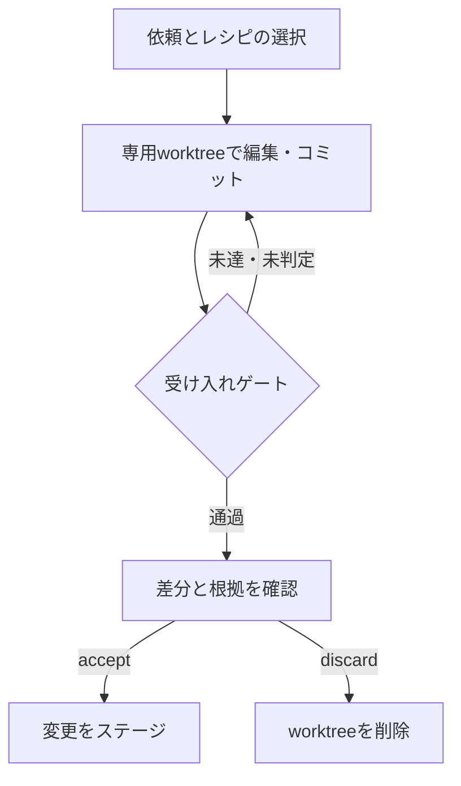

# rig

<p align="center">
  
</p>

**AIに頼んだ変更を、差分と検証結果を見てから取り込むための開発ツールです。**
Rigはタスクごとに作業用のgit worktreeを作り、受け入れ基準に沿って結果を確認します。
変更を取り込む`accept`と、作業を破棄する`discard`を明示的に選べます。

[English README](./README.md) · [CHANGELOG](./CHANGELOG.md)

まずは[導入手順](#install)と[基本フロー](#workflow)を参照してください。
2.xから更新する場合は[v3への移行](#300-への移行)も確認してください。

Claude Codeではプラグイン、CodexではスキルとCLIから利用します。
ChatGPTにはMCP接続を用意しています。ChatGPT WorkにRigの個人スキルを導入した環境では、会話からも呼び出せます。
使える実行環境やフックは、導入方法によって異なります。

## 1. rig とは何か

「ログインの不具合を直して」のように依頼すると、Rigがタスクの種類に合う手順を選びます。
この手順をrecipe（レシピ）と呼びます。実装、テスト、レビューの結果はタスクごとに記録します。
最後にacceptance-gate（受け入れゲート）を評価し、未達の条件があれば通常の`accept`を拒否します。

Rigが確認できる範囲は、用意した基準、テスト、センサー、レビュアーに依存します。
要件の取り違えや、テストにない不具合まで自動で防げるわけではありません。
レビューを増やすと実行時間やモデルの利用量も増えるため、必要な手順を選んで使います。

### 位置づけ

Claude Codeのプラグインは、コマンド、スキル、サブエージェント、フックを組み合わせて動きます。
裏側の処理はPythonパッケージ`rig_workbench`にあり、`rig-wb` CLIからも呼び出せます。
CIや別のアシスタントから利用しても、worktreeと受け入れゲートには同じ実装を使います。

既存のオーケストレータが作った変更を登録する経路もあります。
使い分けは[機能と設計方針](./docs/landscape.md)、連携方法は[外部オーケストレータとの連携](./docs/byo-orchestrator.md)を参照してください。

### 参考にした考え方

[nrslib（成瀬允宣さん）](https://zenn.dev/nrs)の次の考え方を採用しています。

- [Faceted Prompting](https://zenn.dev/nrs/articles/5d19b4c8a39ecb)：プロンプトを役割、方針、知識、指示、出力形式に分ける考え方です。Rigの`facets/`とプロンプトの組み立てに反映しています。
- [ループエンジニアリング](https://zenn.dev/nrs/articles/e4a2ae8a9fb785)：発見、委譲、検証、保持、予約を継続する考え方です。`goal-loop`レシピと同名のwikiで参照しています。

Rigでは、これらに受け入れ判定、機械センサー、レビューの検出率測定、実行記録を組み合わせています。

## 2. まず、やりたいことを言う

導入済みのClaude Codeでは、次のように依頼します。

```text
/rig:go "ログインバグを直して"
/rig:go "このPRをレビューして"
/rig:go "READMEの日本語を読みやすくして"
```

Rigがレシピと作業場所を表示し、作業後に差分と検証結果を返します。
確認には次のコマンドを使います。

```text
/rig:go status
/rig:go diff
/rig:go accept
/rig:go discard <task-id> --yes
```

Codexでは`$rig`、Rigの個人スキルを導入済みのChatGPT Workでは`@rig`を入口にします。
CLIだけを使う場合は、`rig-wb wb new`で作業場所と基準を作り、実装や判定の根拠を自分で記録します。
`new`だけではAIによる実装まで自動実行しません。

プロジェクト設定ファイルは必須ではありません。
実行状態を置く`.rig/`は、Gitに含めないよう`.gitignore`に追加してください。
端末がある場合は追加の確認が出ます。非対話環境ではファイルを変更せず、必要な行を案内します。

`tests/test_first_run_cost.py`は、設定のないGitリポジトリで`new`が入力待ちにならず成功することを確認しています。
検証対象はタスク作成までです。後続の実装やテストには、選んだモデルやプロジェクトの依存関係が必要です。

<a id="install"></a>

## 3. インストール

GitとPython 3.10以上が必要です。レシピの読み込みにはPyYAMLを使います。
CLIをインストールすると、宣言済みの依存パッケージも導入されます。

| 利用環境 | 導入するもの | 入口 |
|---|---|---|
| Claude Code | Rigプラグイン | `/rig:go` |
| Codex | Codex用スキルとRigの実行環境 | `$rig`、`rig-wb` |
| ChatGPT Work | Rigの実行環境を同梱した個人スキルを別途導入 | `@rig` |
| ChatGPTなどのMCPクライアント | Rig MCPサーバとクライアント側の接続設定 | MCPツール |
| CI・スクリプト | `rig-workbench`パッケージ | `rig-wb` |

### Claude Code

Claude Codeの中で実行します。

```text
/plugin marketplace add itoh-shun/sito-plugins
/plugin install rig@sito-plugins
```

共有marketplaceを使わず、本リポジトリから導入する場合は次の2コマンドです。

```text
/plugin marketplace add itoh-shun/rig
/plugin install rig@rig
```

プラグインからの利用に、`rig-wb`のグローバルインストールは不要です。
CLIも使いたくなったら`/rig:setup`で導入できます。`/rig:setup --check`は確認だけを行います。

### CLI

リリース版を指定してインストールする例です。`pipx`の代わりに`uv tool install`も使えます。

```bash
pipx install 'git+https://github.com/itoh-shun/rig.git@v3.0.1'
rig-wb version
```

タスク操作は、対象プロジェクトのGitリポジトリで実行します。

```bash
rig-wb wb new "READMEの日本語を読みやすくする" --type documentation
rig-wb wb status
rig-wb wb board
```

### CodexとChatGPT

Codex用のスキルは[`codex/skills/rig/SKILL.md`](./codex/skills/rig/SKILL.md)です。
配置方法とフックの範囲は[Codex向けの設定](#codex-setup)を参照してください。

ChatGPT Workの個人スキルは、このリポジトリのClaude Code用marketplaceからは導入されません。
実行環境を同梱したスキルを導入した場合は、そのスキルが指定するランチャーを使います。
スキルを追加するだけで、Codex CLIやClaude CLI、MCP接続、フックまで有効になるわけではありません。

MCP経由で使う場合は、[サーバの起動方法](./docs/remote-mcp.md)と[ChatGPTとの接続手順](./docs/chatgpt-mcp.md)を参照してください。

## 4. メイン入口

Claude Codeで通常の開発作業を頼む入口は`/rig:go`です。
原因や進め方を相談しながら決めたい場合は`/rig:talk`を使います。

```text
/rig:talk "ログインの不具合が再発した。原因から調べたい"
```

レシピや実行範囲を指定したい場合は`/rig:dev`を使います。
旧コマンド`/rig:rig`は3.xで非推奨の互換用コマンドとして残り、4.0.0で削除する予定です。
既存の手順は`/rig:go`へ置き換えてください。

<a id="workflow"></a>

## 5. 安全な基本フロー

以下は`/rig:go`と`rig-wb wb`のworkbenchフローです。
レシピランナーの取り込み方法は[CLIでの継続実行](#recipe-runner)を参照してください。



読み取り専用のレビューや調査では、worktreeの作成を省略できます。
タスク作成時には、分類、選んだレシピ、作業場所、受け入れ基準が表示されます。
ゲートを通った後も、差分と残る注意点を確認してから反映します。

## 6. なぜ安全か

### 作業場所の分離

変更を伴うタスクでは、専用のgit worktreeとブランチを作ります。
通常の手順ではそこで編集し、`accept`で元の作業ツリーへ取り込みます。
ただし、worktreeはOSのサンドボックスではありません。
コマンドの書き込み先やネットワークアクセスは、実行ホストの権限設定にも依存します。
Rig自身の実行記録は、タスク開始時からリポジトリの`.rig/`に保存します。

| 保存先 | 内容 |
|---|---|
| `<repoの親>/rig-worktrees/<repo名>/<task-id>/` | 既定の作業用worktree |
| `.rig/runs/<task-id>/task.json` | 入力、タスク種別、ブランチ、作業場所、状態 |
| `steps.json` / `acceptance.json` | 手順の進捗、基準ごとの判定と根拠 |
| `review.json` / `reviews/<persona>.md` | レビュアー別の判定と本文 |
| `plan.md` / `diff.md` / `log.md` / `final.md` | 計画、差分の要約、経過、結果 |

表の2行目以降のファイルは`.rig/runs/<task-id>/`に置かれます。
保存先やライフサイクルは[worktreeの設計](./skills/engine/patterns/isolated-worktree.md)を参照してください。

複数タスクを動かす場合は`/rig:queue`を使えます。
worktreeは分かれますが、外部サービスや同じポートなど、Gitの外にある資源の競合には注意が必要です。

```text
/rig:queue add "ログイン画面のバグを直して"
/rig:queue add "在庫一覧に検索機能を追加して"
/rig:queue go --provider rig --max-parallel 2
/rig:go board
```

queueの完了は、自動的な`accept`を意味しません。
依存タスクを`--depends-on`で指定した場合は、先行タスクが受け入れられるまで待機します。
この依存関係はlocal backendで扱います。

画面検証の画像は、タスク内の`visual/`に保存します。
`discard`で削除し、それ以外は`gc`の経過日数による削除対象です。
既定は14日超で、`rig-wb wb gc --dry-run`で対象を確認できます。
詳しくは[画像の保存と削除](./skills/engine/patterns/visual-artifacts.md)を参照してください。

### 受け入れゲート

実装や文書整備などのタスクには`standard`を使い、種別に応じた基準を追加します。
読み取り専用の`review`は`review`基準、`security_review`は`review`と`security`基準を使います。
現在の一覧は`rig-wb wb gates`で確認できます。

| プリセット | 主な確認内容 |
|---|---|
| `standard` | 依頼の充足、差分の範囲、要約、リスク、テスト、型、機密情報、ゲート改変、指示注入、破壊的操作 |
| `bugfix` | 原因、修正の範囲、回帰テスト、既存動作の維持 |
| `feature` | 要件、テスト、公開API、互換性や移行 |
| `refactor` | 動作の境界、意図しない変更、無関係な改修 |
| `review` | 具体的な指摘、重大度、参照先、修正必須かどうか、誤検知の検討 |
| `security` | 認証・認可、入力、秘密情報、危険な実行、依存関係 |

機械センサー8本が、次の項目を検査します。
意図の充足やテスト結果の説明など、操作者が根拠を記録する項目もあります。
全項目を機械が自動判定する仕組みではありません。

| 検査 | 対象と判定 |
|---|---|
| 秘密情報 | 差分をスキャンし、検出があれば失敗。表示する抜粋はマスクします |
| ゲート改変 | ゲート設定、レシピ、CIの変更を検査。テストの弱体化は条件に応じて警告します |
| 指示注入のマーカー | 差分とリポジトリ内の文章を検査。不可視文字などは失敗、疑わしい指示表現は警告します |
| 破壊的コマンド | 差分に含まれるコマンドを検査。実行時のコマンドを傍受する機能ではありません |
| OpenAPIの変更 | API変更が差分要約に記載されているかを確認。警告として扱います |
| プロンプト回帰 | プロンプト資産を変更したときに追加し、評価ケースの証拠で判定します |
| 証拠アンカー | 明示的に有効化した場合、レビュー本文の`file.py:42`などが実在するかを検査します |
| 日本語校正 | 日本語の散文を追加した差分に`ja_lint_clean`を追加し、長文や冗長表現などを検査します |

日本語の散文には、`ai-smell-reviewer`の判定を写す`ja_prose_ai_smell_reviewed`も追加されます。
これは機械センサーの数には含めません。レビュアーの判定がない間は未判定です。

基準は`.rig/gates.json`の`extra_criteria`で追加できます。
組み込み基準の削除や緩和はできません。
`evidence_anchors_resolve`は既定では無効で、worktreeのあるタスクで使う基準です。

各基準は`passed`、`failed`、`warning`、`skipped`などの状態を持ちます。
`gate --set`で記録する際は、実際に確認した根拠を付けてください。
秘密情報などのセンサーと矛盾する「合格」の宣言は拒否されます。
プロンプト回帰の判定は`--set`で変更できません。

`failed`や`pending`が残る場合、または全基準が`skipped`の場合、通常の`accept`は止まります。
警告だけなら受け入れ可能ですが、その内容は確認が必要です。
`--force`の扱いは[変更の取り込み](#accept-change)を参照してください。

### 読み取り専用の検証

実装役と検証役を別の呼び出しにし、それぞれにモデルやプロバイダを指定できます。
異なる会社や種類のモデルが自動的に選ばれるとは限りません。

Claude CLIの検証役にはツール制限、Codex CLIの検証役には`--sandbox read-only`を指定します。
制限の強さはホストとプロバイダによって異なり、すべての経路で同じサンドボックスが働くわけではありません。
`probe`で接続を確認でき、`selftest`では引数などの組み立てを検証します。
実際のホストで制限が働くかの確認も必要です。

検証役は、生成役の説明に加えて実際の差分を確認します。
複数のレビューを使う場合も、同じ種類のモデルが同じ欠陥を見逃す可能性は残ります。

### 反映操作と記録

`accept`は変更をステージし、コミットは作りません。
`discard`はworktreeとブランチを削除しますが、実行ログは残します。
外部のデータベースやサービスに対する変更を巻き戻す操作ではありません。

フックを導入したホストでは、会話の中断や圧縮後に実行状態を再提示します。
復元できる範囲は、ホストのイベントと保持された状態に依存します。

<a id="7-core-commands"></a>

## 7. 基本コマンド

Claude Codeでの操作と、CLIでの対応です。`<id>`はタスクIDに置き換えてください。

| Claude Code | CLI | 用途 |
|---|---|---|
| `/rig:go "<タスク>"` | `rig-wb wb new "<タスク>"` | タスクを開始。CLIの`new`は作成まで |
| `/rig:go status <id>` | `rig-wb wb status <id>` | 進捗、ゲート、次の操作を表示 |
| `/rig:go diff <id>` | `rig-wb wb diff <id>` | 差分と要約を表示 |
| `/rig:go accept <id>` | `rig-wb wb accept <id>` | 条件を確認して変更をステージ |
| `/rig:go discard <id> --yes` | `rig-wb wb discard <id> --yes` | 作業用worktreeを削除 |
| `/rig:go board` | `rig-wb wb board` | 複数タスクの状態を一覧 |
| `/rig:go log` | `rig-wb wb log` | 過去のタスクを表示 |

<a id="8-feature-status"></a>

## 8. 機能の提供状況

Stableは基本機能、Betaは出力や運用方法を改善中の機能です。
利用中のホストやモデルでの動作を一律に保証する分類ではありません。

| 領域 | 状況 | 内容 |
|---|---|---|
| タスク分類、worktree、受け入れゲート | Stable | レシピ選択、作業場所の分離、条件の確認 |
| diff、accept、discard | Stable | 差分確認、ステージへの反映、作業の破棄 |
| 検証役の制限 | Stable | 対応プロバイダで検証役向けの引数を指定 |
| 実行記録、構造検証 | Stable | ログ保存、資産の構成と参照の検査 |
| board、stats、drill、queue | Beta | 状態一覧、集計、検出率の測定、並列実行 |
| GitHub連携 | Beta | Issue、PR、CIに関連する作業 |
| 知識管理、計画、拡張パック | Beta | 知識の追加、手順の設計、用途別の拡張 |
| 組織・ステージのガバナンス | Beta | 共通ポリシー、権限、承認、期限付き例外、監査 |

<a id="9-task-routing-&#12392;-recipes"></a>

## 9. タスクの分類とレシピ

レシピは、persona（担当する役割）、instruction（作業指示）、pattern（進め方）を組み合わせます。
代表的なレシピは次のとおりです。

| レシピ | 用途 |
|---|---|
| `bugfix` / `feature` / `refactor` / `documentation` | 修正、機能追加、整理、文書整備の既定手順 |
| `review-only` / `pr-review` | 現在の差分、既存PRのレビュー |
| `debug` | 再現と原因調査を重視した修正 |
| `release-flow` | リリース準備からPR、マージまで |
| `design-first` / `design` / `design-audit` | 設計、UI作成、画面の監査 |
| `hotfix` | 手順を絞った緊急修正 |
| `adversarial-review` | 不要なコメントや過剰な抽象化など、コードの可読性を見直す |
| `de-ai-smell` | 散文の不自然さや冗長さを見直す |
| `goal-loop` | ゴールに向けた継続作業 |

全レシピは`/rig:dev --list`、拡張を含む一覧は`/rig:catalog`で確認できます。
資産の一覧は[`BRICKS.md`](./skills/engine/BRICKS.md)を参照してください。

<a id="accept-change"></a>

## 10. diff / accept / discard

`diff`は変更ファイルに加え、`diff.md`の次の見出しを表示します。
見出し名は出力の読み取りに使うため、英語のまま記述します。

```markdown
## Summary
メールアドレスに大文字が含まれるとログインできない問題を修正。

## Risk
変更はメールアドレスの正規化処理に限定。

## Tests
大文字を含むメールアドレスの回帰テストと既存テストが成功。

## Unrelated diff
なし。
```

`Recommended`はゲートの状態から表示される案内です。
最終的な受け入れ可否は、`accept`が改めて確認します。
Pythonの変更では、シグネチャや本体の変更を区別する意味的な差分も表示します。

`accept`の主な確認項目は次のとおりです。

| 条件 | 意味 |
|---|---|
| `worktree_exists` | 作業用worktreeがある |
| `base_branch_recorded` | 取り込み先のブランチが記録されている |
| `diff_summary_generated` | 差分要約が用意されている |
| `acceptance_gate_not_failed` | ゲートが受け入れ可能な状態にある |
| `no_unrelated_diff` | 無関係な差分についての基準を満たす |
| `gate_judged_this_head` | 検証済みコミット、作業用ブランチの先端、worktreeのHEADが一致する |
| `no_rejected_reviews` | 記録されたレビュアー別判定に`REJECT`が残っていない |

最初の3条件は`--force`でも省略できません。
残る条件の例外には`--force`を使いますが、権限や組織ポリシーにも従います。
例外が禁止された基準は回避できず、必要なwaiver（期限付き例外）がなければ拒否されます。
回避した条件は監査ログに、強制取り込みの事実は署名付きの来歴に記録します。
拒否されたレビューを回避した場合、その判定も両方に記録します。

v3.0.1から、`accept`はその時点のレビュー記録も確認します。
ゲート通過後の`REJECT`でも通常の反映を止めます。
別のレビュアーの承認やゲートの再実行では解除されません。
修正後、拒否したレビュアーの再評価を記録してください。
不正なレビュー記録は`--force`でも受け付けません。

レビュー記録自体がないタスクに、全レビュアーの承認を新たに要求する変更ではありません。
`APPROVE_WITH_CONDITIONS`もこの拒否条件には含みません。
読み取り専用のレビュータスクでは、レビュー作業の完了と対象変更の承認を区別します。

作業用worktree内で変更をコミットし、そのコミットでゲートを評価してから`accept`を実行してください。
未コミットの変更がworktreeに残っている場合も、受け入れを拒否します。
条件を満たすと、タスクのブランチをsquash mergeし、元の作業ツリーに未コミットの差分をステージします。
取り込み先に未コミットの変更がある場合などは、先にその状態を解消する必要があります。

`discard <id>`は削除対象を表示するだけです。
`--yes`を付けるとworktreeとブランチを削除し、ログを残します。

<a id="11-run-board-&#12392;-stats"></a>

## 11. タスク一覧と集計

`board`は実行中、ゲート通過、失敗などの状態を一覧にします。
過去のタスクも見る場合は`--all`を付けます。
`cockpit`は進捗、ゲート、レビュー、費用を読み取り専用の画面にまとめます。
記録のない値は未計測として表示します。

```bash
rig-wb wb board --all
rig-wb wb cockpit
rig-wb wb stats --recipe bugfix
rig-wb wb digest --period week
```

`stats`は受け入れ・破棄の件数、失敗しやすい基準、レビュアーの判定を集計します。
拒否のないレビュアーへの警告は、レビュー内容を確認するきっかけです。
拒否率だけでレビューの質を判定するものではありません。

複数リポジトリの集計は[EvidenceとMission Control](./docs/evidence-mission-control.md)、操作画面は[Mission ControlのUI](./docs/interactive-mission-control.md)を参照してください。

<a id="12-reviewer-drill"></a>

## 12. レビューの検出力を測る

`/rig:drill`は既知の不具合を使い捨ての差分に埋め込み、レビュー結果を採点します。
正解情報はレビュアーに渡しません。
検出率、誤検知、重大度、修正必須かどうか、説明の具体性を確認し、役割ごとの見落としを調べます。
`--replay <persona>`では、保存した差分を使って再評価できます。

### ベンチマークで確認できること

| コマンド | 確認すること | 結果の範囲 |
|---|---|---|
| `rig-wb sensor-bench` | 固定の入力に対する機械センサーの検出と誤検知 | その入力集合に対する結果。設計や業務ロジックの品質は測りません |
| `rig-wb bench` | 直接実行とRig経由の実行を、同じ課題・開始状態で比較 | 指定したモデルと課題の結果。実モデルの評価には利用料がかかります |
| `rig-wb bench-invariance` | 複数モデルで結果の一致率と安全に終了した割合を比較 | 実行したモデル群の範囲で評価します |

```bash
rig-wb sensor-bench
rig-wb bench --provider mock --runs 3 --out /tmp/rig-bench.json
```

`mock`は実行経路とレポート生成の確認用です。品質向上を測った結果にはなりません。
実モデルを使うベンチマークには`--allow-paid-provider`が必要です。
`--bare-model`と`--rig-model`で比較するモデルを分けることもできます。

比較レシピ`adaptive-bugfix`は明示的に選んで使います。
通常の`bugfix`の既定ルートを置き換えるものではありません。
schema v2では課題数、反復数、欠陥率、安全に停止した割合、呼び出し数、実行障害を評価します。
比較元に欠陥がない場合は`inconclusive`（終了コード1）として扱います。

実モデルの測定では、Rig経由でも改善しなかった課題があります。
条件と結果は[難しい課題のベンチマーク](./benchmarks/hard-tasks/README.md)に記録しています。
Rig自身の数値はローカルで集計できますが、マージごとに最新スコアを自動公開する仕組みはありません。

### MCPサーバ

MCP SDKを使うサーバは`rig-mcp`です。
リポジトリを固定して起動し、既定では読み取り専用ツールだけを公開します。
書き込みツールの有効化やHTTP接続の認証境界は[remote MCP](./docs/remote-mcp.md)を参照してください。

従来の`python3 scripts/mcp_server.py`は、標準ライブラリだけで動くローカルstdio用アダプタです。
`rig-mcp`とはツール名と引数の契約が異なり、そのまま置き換えることはできません。
ツール定義の静的な検査には`python3 /path/to/rig/scripts/orchestrate.py mcp-scan`を使います。

### モデル選択と費用

`--auto-route`は差分の規模に応じて、宣言した候補からモデルを選びます。
明示した`--step-model`やレシピ内の`model:`が優先されます。
`--auto-route-learn`は実行履歴を参考にしますが、既定のshadow modeでは選択を変更しません。
適用には`--auto-route-mode active`が必要です。

費用やトークンは、プロバイダが構造化された利用量を返した場合に記録します。
CLI経由で取得できない値は未計測と表示します。
`--budget-minutes`は見積もりの記録で、時間制限ではありません。

### 性能と観測

`rig-wb perf`はプロバイダの待ち時間とRig自身の処理時間を分けて集計します。
性能の回帰判定には、保存した基準値を使います。

```bash
rig-wb perf --recipe bugfix
rig-wb perf --recipe bugfix --save-baseline perf.json
rig-wb perf --recipe bugfix --check --baseline perf.json
```

`rig-wb otel --dry-run`では、OpenTelemetryへ送る内容を確認できます。
エクスポートはローカル記録をもとに行い、送信失敗でゲートの判定を変えません。
送信対象のフィールドは限定し、プロンプトや差分の本文は送りません。

### Orcaランタイム

`--runtime`は作業場所の管理方法、`--provider`はモデルの呼び出し方法を指定します。
`--runtime auto`はOrcaの実行環境と利用可能なCLIを確認し、条件を満たさなければnativeを使います。
`--runtime orca`を明示した場合は、利用できなければ失敗します。
設定と復旧手順は[Orca連携](./docs/orca.md)を参照してください。

## 13. GitHub 連携

| コマンド | 操作 |
|---|---|
| `/rig:go gh issue <n>` | Issueを読み、タスクに振り分ける |
| `/rig:go gh pr <n> review` | PRをレビュー。`--comment`はコメント投稿を指定 |
| `/rig:go gh pr <n> fix` | PRのブランチを基点に、専用worktreeで修正する |
| `/rig:go gh ci` | 現在のブランチやPRのCIを確認する |

投稿やpushには、その操作への明示的な指示が必要です。
IssueやPRの本文は作業対象のデータとして扱います。
Rigは外部テキストを区切り、不可視文字などを処理しますが、区切りだけで指示注入を完全に防げるとは限りません。

GitHub Actions向けには[`action.yml`](./action.yml)を用意しています。
内部では同じランナーを`--isolate`付きで呼び、ゲート通過時に限って指定されたPR作成処理へ進みます。
モデルの認証情報とリポジトリへの書き込み権限は、利用するworkflowで設定してください。
mockによる実行経路のテストと、実際のGitHub上でのpush・PR作成の確認は別です。

<a id="14-advanced-commands"></a>

## 14. 詳細設定と追加コマンド

| 分類 | 主なコマンド |
|---|---|
| 品質の確認 | `/rig:drill`、`/rig:pr`、`/rig:harness`、`/rig:qa`、`/rig:japanese-lint` |
| 知識の管理 | `/rig:import`、`/rig:export`、`/rig:catalog`、`/rig:knowledge`、`/rig:persona`、`/rig:forge` |
| 計画と継続作業 | `/rig:goal`、`/rig:design`、`/rig:brainstorm`、`/rig:tasks`、`/rig:loop` |

完全な一覧は[`BRICKS.md`](./skills/engine/BRICKS.md)、オプションの定義は[`SKILL.md`](./skills/engine/SKILL.md)を参照してください。

### レシピと実行範囲を指定する

```text
/rig:dev --plan --only review "現在の変更"
/rig:dev --only review
/rig:dev --recipe release-flow --design "機能X"
/rig:dev --recipe hotfix --issue 1234
```

`--plan`は構成を表示して停止します。
`--only`、`--from`、`--to`で範囲を指定し、`--design`、`--review`、`--tdd`で手順を追加できます。
`--autonomous`でも、受け入れゲートは解除されません。

### ソースから利用する

プラグインの開発時は`claude --plugin-dir /path/to/rig`で読み込めます。
`/path/to/rig`は、このリポジトリを取得した場所に置き換えてください。
ソース内のスクリプトを別のプロジェクトから呼ぶときも、Rig側の絶対パスを指定します。

<a id="codex-setup"></a>

### Codex向けの設定

本リポジトリを取得したうえで、Codex用スキルを配置します。
既存の`rig`スキルがある場合は、配置先を確認してから更新してください。

```bash
mkdir -p ~/.agents/skills
ln -s /path/to/rig/codex/skills/rig ~/.agents/skills/rig
```

プロジェクト内だけで使う場合は`.agents/skills/rig/`に配置します。
Codexでスキルを読み込み直した後、`$rig`で呼び出します。
タスク操作には`rig-wb wb ...`、ソースを直接使う場合は`python3 /path/to/rig/scripts/workbench.py ...`を使います。
作業ディレクトリは対象プロジェクトにしてください。

| 同梱ファイル | 用途 |
|---|---|
| `codex/skills/rig/SKILL.md` | 既存のworkbenchとランナーを使うための手順 |
| `codex/hooks.json` | `PreCompact`と`SessionStart`の設定 |
| `.codex/agents/security-reviewer.toml` | 読み取り専用のセキュリティレビュアー定義 |
| `.codex/agents/behavioral-correctness-reviewer.toml` | 動作の正しさを確認するレビュアー定義 |

フックを使う場合は`codex/hooks.json`をプロジェクトの`.codex/hooks.json`へ配置します。
フックはGitルートからスクリプトを探すため、そのプロジェクトに対応する`hooks/`も必要です。
設定ファイルだけをグローバル設定へコピーしても動きません。

Codexの`PreCompact`では、処理の継続を許可するJSON（`{"continue":true}`）を返します。
圧縮後の`SessionStart`で残った状態の再提示を試みますが、圧縮時に失われた情報は復元できません。
フックのコマンド実行は回帰テスト済みです。
ホスト自身のイベント発火、スキルの検出、サンドボックス、MCP接続は、利用環境で確認してください。

### その他のホストと実験的な連携

ホストごとの対応表は`python3 scripts/host_adapters.py`で表示できます。
`supported`、`partial`、`unsupported`、`unverified`を区別しています。
CursorやGrok Buildも登録されていますが、未検証の項目を動作確認済みとして扱わないでください。
Grokの検証役など、読み取り専用の強制がプロンプト指示に限られる経路もあります。

Anthropic HTTPプロバイダには拒否応答やフォールバックを記録する処理があります。
Managed Agentsへの委譲も実験的な設定として用意しています。
実APIでの確認範囲と設定は[`commands/orchestrate.md`](./commands/orchestrate.md)を参照してください。

VS Code向けの状態表示は[`vscode-extension/README.md`](./vscode-extension/README.md)に導入手順があります。
読み取り専用で、拡張から`accept`や`discard`は実行しません。

### プロンプト評価

プロンプト資産の変更は、登録済みの評価ケースと照合します。

```bash
rig-wb eval affected --base origin/master --ratchet
```

`--ratchet`では、まだ評価ケースがない資産を`coverage_debt`として報告します。
既存のカバレッジを減らす変更は失敗します。
評価ケースがある資産には、その変更を裏付ける証拠が必要です。
forkからのPRなどの手順は[評価ケースの運用](./docs/evaluation-cases.md)を参照してください。

### プロジェクト設定と知識

`/rig:init`で`.claude/rig.md`を作り、ビルド、lint、テスト、レシピなどの既定値を設定できます。
形式は[設定テンプレート](./skills/engine/manifests/_template.md)を参照してください。

プロジェクトのレシピには実行コマンドが含まれるため、初回読み込みには内容への同意が必要です。
同意は内容のハッシュと結び付けて保存し、変更後は再確認します。
未承認のmanifestは警告を出して無視し、既定値で処理を続けます。

`instincts`は、未検証の作業パターンを確信度付きで記録します。
検証済みの知識とは分けて管理し、矛盾する記録は`--supersedes`で明示的に置き換えます。
意味上の矛盾を自動検出する機能ではありません。
`--promote`と`--demote`で、プロジェクトとホストの保存先を移せます。

<a id="recipe-runner"></a>

### CLIでの継続実行

`rig-wb run <recipe> --provider <provider>`でレシピを実行します。
変更を伴う作業には`--isolate`を付けてください。
このランナーは、完了時にコミットがあり、両方の作業ツリーがクリーンで、fast-forward可能なら元のブランチへ自動反映します。
`wb accept`の操作を待つフローではありません。未達や未コミットの変更、競合などがあればworktreeを残します。
差分を確認してから明示的に受け入れたい場合は、workbenchフローを使ってください。
プロバイダのCLIや認証情報は別途必要です。
`resume`は現在の手順を再検証してから再開します。
git hookの導入には`rig-wb githooks install`を使います。
導入時点のmanifestにあるコマンドを確認してから実行してください。

<a id="15-opt-in-extension"></a>

## 15. 追加パック

用途別の機能はpackとして追加できます。
内容と入手元を確認したものを、project、user、orgのいずれかの範囲へ導入します。
導入だけで、ホストのスラッシュコマンドまで自動登録されるわけではありません。

```bash
rig-wb pack list
rig-wb pack verify-sources --scope project
rig-wb pack knowledge --topic backup --scope product
```

`verify-sources`はGitの入手元が記録されたpackを確認します。
対象外のpackについて検証したことにはなりません。

`pack knowledge`は質問に関連する資料の候補を探します。
資料が指す範囲と、packの導入先の範囲は別です。
候補が複数の知識範囲にまたがる場合は、曖昧であることを報告します。
作成と導入は[packの手順](./docs/packs.md)、切り出しは[packの移行](./docs/pack-migration.md)を参照してください。

<a id="16-implementation-notes"></a>

## 16. 実装と検証の対応

| 確認するもの | 主な実装・検証経路 |
|---|---|
| レシピ解決、worktree、プロバイダ引数、queue | `scripts/orchestrate.py selftest`、`tests/` |
| 資産の形式、参照、バージョン整合 | `scripts/validate.py`とその`selftest` |
| ゲート、accept、discard | `rig_workbench/workbench/`とライフサイクルのテスト |
| レビュー拒否後のaccept | `tests/test_review_accept.py` |
| 文書化した要求と証拠の対応 | `rig-wb coverage`、`evals/coverage-map.json` |
| ホスト側の前提 | `rig-wb hostcheck`。確認できなかった項目はMISSとして報告 |
| テストの欠陥検出力 | `rig-wb mutation`。プロジェクト側の測定ツールの結果を使用 |
| プロンプト変更の証拠 | `rig-wb eval affected --ratchet`、`evals/prompt-surfaces.json` |
| ASVSと検査の対応 | `rig-wb asvs`、`evals/asvs-map.json` |
| 受け入れの根拠と来歴 | `rig-wb wb receipt <id>`、`--verify`による元データの再確認 |
| 要件と確認方法 | `rig-wb wb intent`、`intent-derive` |
| 要求した保証水準と観測結果 | `rig-wb wb assurance-target`、`assurance-derive` |
| 外部で作った変更の登録 | `rig-wb wb import`、`contract` |

未観測の情報は、受け入れの根拠として補いません。
receiptは記録を表示するもので、ゲートを再判定しません。
実装の構成は[アーキテクチャ](./docs/architecture.md)を参照してください。

## 17. FAQ

### 作業中、元の作業ツリーは変更されますか

通常の編集は専用worktreeで行います。実行記録は元のリポジトリの`.rig/`にも作成します。
worktreeはプロセスのアクセス制限ではないため、ホスト側の権限も設定してください。

### ゲートを通れば、不具合がないと言えますか

確認した条件を満たしたことが分かります。
その条件に含まれない要件や、レビュアーが見逃した不具合は残り得ます。
差分、テスト範囲、警告を確認して受け入れてください。

### ゲート通過後にacceptが止まるのはなぜですか

検証後にコミットが変わった、レビューに`REJECT`が残っている、承認や権限が不足している、といった理由があります。
`accept_requirements`の表示を確認してください。
検証対象が変わった場合は、現在のコミットで検証し直します。

### 設定ファイルや組織ポリシーは必要ですか

個人で基本機能を使うだけなら必須ではありません。
プロジェクト共通の既定値は`/rig:init`、組織共通の規則は`rig-wb govern`で追加します。

## 18. 組織ガバナンス（v2）

複数のリポジトリに共通のポリシーを適用できます。
org、team、projectの順に設定を組み合わせ、下位の設定で上位の制約を緩めることを拒否します。

| 機能 | 内容 |
|---|---|
| policy | 共通基準や承認条件を適用 |
| permission | ロールごとに操作権限を設定 |
| approval | 必要人数、承認者のロール、著者との分離、対象コミットを確認 |
| waiver | 理由と期限を付けて例外を許可。`non_waivable`は例外不可 |
| ledger | ハッシュ連鎖や署名で監査記録の整合性を確認 |
| conformance | リポジトリの適合状況を検査・集計 |

```bash
rig-wb govern policy show
rig-wb govern whoami
rig-wb govern audit verify
rig-wb govern conformance
```

導入は`rig-wb govern init --org <組織名> --team <チーム名>`から始めます。
共有ポリシーの場所は`RIG_POLICY_HOME`で指定します。
組織への所属を設定していないリポジトリでは、この組織ポリシー層は動きません。

承認はゲートに追加する条件です。通常の承認だけで、未達のゲートを通過扱いにはしません。
監査の検証強度は、署名鍵の保護とポリシーに依存します。
署名の確認と、実際に誰が操作したかの本人確認は区別してください。

### ステージごとの承認

レシピの`actor`と`human_gate`で、承認を待つ段階を指定できます。
承認待ちは保存され、後から再開できます。
`actor`は担当ロールを示し、そのロール以外による実行自体を禁止する設定ではありません。
承認時には必要なロール、人数、実行者との分離、対象の鮮度を確認します。
組織ポリシーから`stage:<id>`に承認条件を追加することもできます。

設定と操作の詳細は[`commands/govern.md`](./commands/govern.md)を参照してください。

## 19. 終了コード

CLIを呼び出す側は、判定結果と実行上の問題を分けて扱ってください。

| コード | 主な意味 |
|---|---|
| `0` | 処理成功、ゲート通過、検出なし |
| `1` | 判定による拒否、ゲート不合格、検出あり |
| `2` | 引数・設定・状態の不備、想定外の例外 |
| `3` | ゲート未判定や承認待ちなど。コマンド固有の意味を確認 |

たとえば`wb gate`は、未判定の項目が残る場合や全項目がskippedの場合に`3`を返します。
一部の既存コマンドには独自の終了コードがあるため、自動処理では各コマンドの契約も確認してください。
`124`、`126`、`127`、`128+N`はタイムアウト、シェル、シグナルの意味を保持します。

## 20. JSON 出力

新しいJSON出力には、形式を表す`schema`、結果を表す`status`、内容を持つ`data`があります。
たとえば`rig-wb wb gates --json`のschemaは`rig.gates/v1`です。
読み手は対応するschemaを確認してから内容を解釈してください。

既存の`--json`には固有の形式も残しています。
全コマンドが同じ構造を返すとは限りません。
形式の一覧は[`rig_workbench/jsonio.py`](./rig_workbench/jsonio.py)を参照してください。

<a id="21-rig-&#12434;&#21628;&#12435;&#12384;&#12398;&#12399;&#35504;&#12363;"></a>

## 21. 呼び出し元の識別

`--caller`または`RIG_CALLER`で、呼び出し元を明示できます。
宣言は環境からの推測より優先され、結果にはどちらから得た情報かも記録します。
自動検出はClaude Codeを対象とし、他のホストは明示的に指定します。

呼び出し元は実行方法の選択に使い、受け入れ基準を緩める理由には使いません。
Claude Code内で同じハーネスを再起動する経路には制限があります。
サブエージェントの深さまでは、この情報から判定できません。

## 3.0.0 への移行

3.0.0では、packの発行者署名を削除しました。
`pack sign`、`pack keygen`、発行者署名の検証、鍵の失効、`--allow-unverified`は使えません。
accept時の来歴や監査記録の署名とは別の仕組みです。

### 既存の設定への影響

| 2.xでの状態 | 3.xでの動作 | 対応 |
|---|---|---|
| 有効な`verified-publisher`のlockと発行者情報が残っている | 読み込み可能。過去のラベルは表示されるが、発行者署名は再検証しない | 通常はlockの移行不要。表示を現在の署名検証結果と混同しない |
| `verified-publisher`なのに必要な発行者情報が欠けたlock | `pack lock drift`で解決に失敗 | 手編集などで壊れたlockを確認。2.xの通常操作はこの組み合わせを作らない |
| スクリプトに`--allow-unverified`がある | 未知の引数としてexit 2 | オプションを削除 |
| `pack sign` / `pack keygen`を呼んでいる | 未知のコマンドとしてexit 2 | その手順を削除 |

### 新しいインストールで記録する状態

`verification_status`は`verified-local`または`unverified`になります。
プロンプト資産を持たないpackは`verified-local`です。
持つ場合は、対象となる全評価ケースについて、現在の実プロバイダによる検証済み結果が必要です。
`mock`や`command`の結果はこの条件を満たしません。

古いlockを読み込むため、`verified-publisher`と発行者情報のフィールドは残しています。
新しいインストールで発行者を認証するものではありません。

### 引き続き確認すること

初めて使うpackは、入手元と内容を確認してください。
内容への同意とハッシュ照合により、承認後の変更や宣言の不整合を検出します。
ハッシュだけでは、その内容を誰が公開したかまでは確認できません。
発行者の鍵を失効させる仕組みも削除されています。

### その他の変更

- `rig-wb ja-lint`と`rig-wb wb scan-ja-prose`で日本語の散文を検査できます。
- workbenchの引数や設定の不備はexit 2を返します。拒否のexit 1と分けてください。
- `govern policy show --json`に`schema: rig.effective-policy/v1`が加わりました。
- 同意フラグは、そのプロセス自身のオプションとして指定した場合だけ有効です。タスク本文に同じ文字列があっても同意にはなりません。

## ドキュメント

| 資料 | 内容 |
|---|---|
| [エンジンの手順](./skills/engine/SKILL.md) | 入力の解釈、レシピの解決、実行 |
| [worktreeの設計](./skills/engine/patterns/isolated-worktree.md) | 作業場所と実行状態の管理 |
| [アーキテクチャ](./docs/architecture.md) | 実装の構成と検証方法 |
| [テストシナリオ](./docs/testing-scenarios.md) | 判断や手順を守れるかの確認 |
| [remote MCP](./docs/remote-mcp.md) | MCPサーバの導入、ツール、権限の境界 |
| [ChatGPTとの接続](./docs/chatgpt-mcp.md) | MCP接続の設定 |
| [EvidenceとMission Control](./docs/evidence-mission-control.md) | 実プロジェクトでの測定と複数リポジトリの集計 |
| [機能と設計方針](./docs/landscape.md) | 対応する領域と設計上の制約 |
| [外部オーケストレータとの連携](./docs/byo-orchestrator.md) | 変更の登録と機械向けの受け入れ判定 |
| [Mission ControlのUI](./docs/interactive-mission-control.md) | `rig-mission-control-live`による操作画面 |
| [評価ケース](./docs/evaluation-cases.md) | 作成、実行、比較、基準への昇格 |
| [packの手順](./docs/packs.md) | 作成、検証、導入、テスト |
| [packの移行](./docs/pack-migration.md) | 独自リポジトリへの切り出しと再導入 |
| [v3の設計](./docs/v3-architecture-design-brief.ja.md) | 内部構成の見直しと移行順序 |
| [プロンプト配置順の測定計画](./docs/facet-order-measurement-plan.ja.md) | 比較条件、必要な試行数、実行上の課題 |
| [Orca連携](./docs/orca.md) | 設定、復旧、他の開発環境との併用 |
| [English README](./README.md) | 英語版 |

## License

[MIT](./LICENSE) © 2026 itoh-shun
