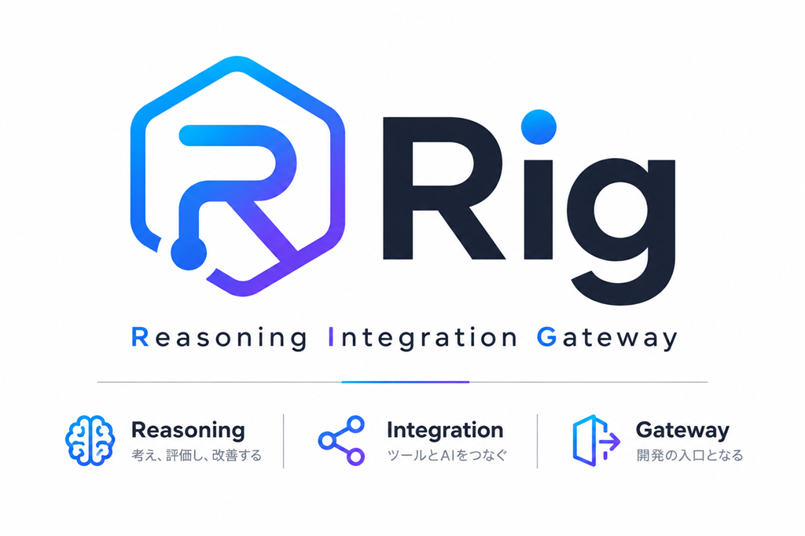

# rig

<p align="center">
  
</p>

**An AI Quality Operating System for Claude Code.** It composes the right harness for each task, runs changes in an isolated worktree, checks the result with acceptance gates, and lets you accept or discard the diff safely — and, for teams, carries one common policy across repositories with permissions, approvals, expiring waivers and a tamper-evident audit trail (§17).

> 🇯🇵 日本語版は [README.ja.md](./README.ja.md) を参照。

## 1. What is rig?

You describe a task in plain language. rig figures out what kind of task it is (bugfix / feature / refactor / review / docs / …), composes the harness it needs (`facets/personas/instructions/patterns` — LEGO-style bricks), runs the work in a **git worktree isolated from your working tree**, checks it against explicit **acceptance criteria** (build/lint/tests, no unrelated diff, no secret leak, findings labeled with severity, …), and only touches your real branch when you explicitly `accept`. "It says it's done" is never the bar — the gate is.

rig's value isn't running AI. It's structurally removing the dangerous parts of letting AI work unsupervised: isolation, verification, measurement, recording, and controlled hand-off.

Put precisely: **rig does not automatically produce quality — it makes the AI unable to ignore the quality bar you define.** Defining that bar stays human work; rig's job is enforcement and measurement. And it costs something: rig deliberately trades speed and tokens for that safety — if you just want code written fast, ask the model directly.

Three properties keep the safety flow real (not just documented):

- **Force-proof accept requirements.** `accept` blocks landing when structural prerequisites are missing (worktree, base branch, diff summary). `--force` overrides *soft* gate failures (recorded to `.rig/audit.jsonl`), but cannot bypass the *hard* prerequisites — the checkpoints live where a flag can't remove them.
- **Cross-provider by design.** The generator and the verifier are separate roles run as separate processes, and each role can pick its own LLM: `claude` / `codex` / `ollama` / `lmstudio` / `cmd` / `mock` / a nested `rig` harness. The default flow can implement with Claude and verify with Codex (or vice versa) — one class of model does not review its own artifacts. `orchestrate.py probe` proves the read-only sandbox is actually applied per provider, not just wired in the config (§5 & §12).
- **Runs as a Claude Code plugin, not an outside CLI.** `/rig:go` lives in the same session as your regular work; the isolation, the gate, and the accept step are all a keystroke away rather than a context switch to a separate tool.

**Where rig stands today:** the core safety flow — routing, isolation, the acceptance-gate, and explicit accept/discard — is implemented and exercised by this repo's own test suite (§15). A layer of quality/observability tooling (drill, board, stats, GitHub integration) sits on top of that and is actively evolving. Optional domain extensions add specialized workflows without entering the default core catalog. §7 breaks all of this down by name.

### Positioning

rig is deliberately **not** a heavyweight external engine with its own DSL. Inside a Claude Code session it is a thin quality/safety layer composed from Claude Code's own primitives — slash commands (`commands/`), the skill (`skills/engine`), subagents (`agents/`), and hooks (`hooks/`). The isolation, the gate, and the accept step add discipline to the session you already work in; they don't replace it with another tool.

The same design has a second face: the deterministic engine behind that layer (`scripts/orchestrate.py`, packaged as `rig_workbench/` and installable via pip as the `rig-wb` CLI) doubles as an **external control plane**. CI, another session, or another tool (Codex, Cursor, …) can drive the exact same recipes, gates, and read-only verifiers from outside a Claude Code session — see §13 "Standalone CLI". The package-native remote/SDK MCP path ships as `rig-mcp`; see [`docs/remote-mcp.md`](docs/remote-mcp.md). The historical stdlib-only local stdio adapter remains `scripts/mcp_server.py` (#263) with a different, non-interchangeable tool contract — see §7.

And the differentiator over "we have quality gates" framings: rig's gates and reviewers are **measured, not asserted**. `/rig:drill` (§11) scores each reviewer persona's actual detection rate against injected known bugs, and `/rig:go stats` (§10) flags rubber-stamp reviewers and frequently-failing gates from real run history. A gate you can't measure is a hope; rig treats gate efficacy as data.

## 2. 30-second start

```bash
/rig:go "fix the login bug"
/rig:go "review this PR strictly"
/rig:go "check my current changes are safe"
```

That's the whole surface for a first run — **zero configuration**: no manifest, no gates.json, no persona setup. Those are all later opt-ins; the safety flow works out of the box. Behind the scenes: rig classifies the task, picks the matching recipe, opens an isolated worktree (skipped for read-only tasks like reviews), implements + tests, runs the acceptance-gate, and hands you back a summary with next steps:

```
/rig:go diff       # see what changed, and why it's safe (or not)
/rig:go accept     # bring the change into your working tree (blocked if the gate hasn't passed)
/rig:go discard    # throw the attempt away — your working tree was never touched
```

What actually changes versus asking the model directly:

| | asking directly | through rig |
|---|---|---|
| a failed attempt | litters your working tree | discarded with its worktree — your tree untouched |
| "it's done" | you take the model's word | the acceptance-gate's verdict is the evidence |
| review quality | unknown | measured — `/rig:drill` scores each reviewer's real detection rate |
| what happened | a chat log | run log, audit trail, signed provenance |

## 3. Main entrypoint

The main command is:

```bash
/rig:go "fix the login bug"
```

**`/rig:go` is the single main entrypoint**, the one worth memorizing before anything else in this doc. `/rig:rig` still works as a compatibility alias — same engine, same arguments — so existing habits and scripts don't break; only the name moved.

`/rig:talk` stays as the conversational front door onto the same engine — useful when you'd rather describe the situation and let rig ask follow-ups than state a single task up front:

```bash
/rig:talk "the login bug is back, not sure why this time"
```

Use `/rig:go` for the full gated workbench flow. Use `/rig:talk` when you want a conversational entrypoint into the same underlying engine.

## 4. Core safety flow

```
natural-language task
        │
        ▼
①  classify (bugfix / feature / refactor / review / docs / security_review / …)
        │
        ▼
②  pick the matching recipe + show why (a one-line routing banner, not a guess)
        │
        ▼
③  open an isolated worktree, run the recipe (implement / test / review, subagent-dispatched)
        │
        ▼
④  acceptance-gate: check intent / diff scope / risk / tests / secrets / severity-labeled findings
        │
        ▼
⑤  structured diff summary + next action
        │
        ▼
user decision
   ├─ accept  → land the staged diff into your working tree
   └─ discard → delete the worktree; the run log stays
```

Every `new` task starts with a **routing banner** so you never wonder why rig picked what it picked:

```
▸ rig
task: fix the login bug
detected: bugfix
recipe: bugfix — matched "bug"/"fix"
mode: isolated worktree
gate: standard + bugfix
```

See §8 for how the recipe behind step ② actually gets composed, and §5 for what backs steps ③–⑤.

## 5. Why it is safe

### Isolated worktree

Every task gets its own git worktree (`patterns/isolated-worktree`) and its own throwaway branch. rig never writes to your working tree directly — a failed or half-finished attempt costs you nothing.

```
<repo parent>/rig-worktrees/<repo-name>/rig-YYYYMMDD-HHMMSS-<slug>/   ← throwaway worktree + branch
<repo>/.rig/runs/rig-YYYYMMDD-HHMMSS-<slug>/                          ← run state (survives discard)
  task.json        task_id / input / task_type / recipe / base branch+commit / worktree path / status
  steps.json       per-step progress
  acceptance.json  {task_id, task_type, presets, status, checks: [{name, status, detail}]}
  review.json      per-reviewer-persona verdicts for review tasks (feeds /rig:go stats)
  reviews/<persona>.md   that reviewer's full text, recorded by `review --body` (optional)
  plan.md / diff.md / log.md / final.md   the model's prose (plan, diff summary, decisions, wrap-up)
```

Read-only tasks (a review, an investigation that hasn't decided to change anything) skip the worktree entirely with `--no-worktree`. See [`patterns/isolated-worktree.md`](./skills/engine/patterns/isolated-worktree.md) for the full design.

**Running several tasks at once, without losing track.** Because isolation is per-task, running multiple tasks concurrently is safe by construction — each gets its own worktree and branch, so they can't step on each other. To actually run them in parallel (instead of typing `/rig:go "<task>"` one at a time), queue them and go:

```bash
/rig:queue add "fix the login bug"
/rig:queue add "add search to the inventory list"
/rig:queue add "make the README clearer"
/rig:queue go --provider rig --max-parallel 3   # dispatches 3 independent headless processes
```

`--provider rig` routes each queued item through `/rig:go "<task>"`, so each one is isolated the same way a task you typed directly would be — no risk of the parallel processes fighting over the same files. Queue's own verifier only confirms the gate resolved and the task stayed isolated; it never accepts on your behalf. Once they're done, `/rig:go board` (§10) is the single place to check every task regardless of how many terminals or queue items are behind them.

**Visual verification screenshots.** `visual-verify` (UI diff checks) and `design-audit` (Playwright screen capture) both produce screenshots. These are disposable evidence, not the deliverable — the conclusion lives in prose (`diff.md`), not the pixels:

```
<repo>/.rig/runs/<task-id>/visual/            ← task-scoped (ran via /rig:go)
<repo>/.rig/visual/adhoc/<ts>-<slug>/         ← ad-hoc (e.g. a standalone /rig:design <url> audit)
```

`discard` deletes a task's `visual/` immediately (the run log's JSON/MD stays). Everything else — including screenshots from accepted tasks — is pruned by age (`python3 scripts/workbench.py gc --dry-run` to preview, `gc` to delete what's 14+ days old). See [`patterns/visual-artifacts.md`](./skills/engine/patterns/visual-artifacts.md) for the full rules.

### Acceptance gate

Acceptance gates decide whether a run is safe to hand off. The model cannot mark work as done by itself — a run must pass mechanical checks such as unrelated-diff detection, test/type/lint status, risk summary, and task-specific requirements. Failed or pending gates block `accept` outright.

Every task gets a criteria checklist drawn from `standard` (applies to every task) plus a task-type-specific preset on top (`scripts/workbench.py gates` is the source of truth):

| preset | applies on top of `standard` for | sample criteria |
|---|---|---|
| `standard` | every task | `task_intent_satisfied` · `no_unrelated_diff` · `diff_summary_written` · `risk_summary_written` · `tests_pass_or_explained` · `no_type_errors_or_explained` · `no_secret_leak` · `no_gate_tampering` · `no_injection_markers` · `no_destructive_operation` |
| `bugfix` | bugfix, performance | `bug_cause_identified` · `fix_is_minimal` · `regression_test_added_or_explained` · `existing_behavior_preserved` · `no_unrelated_refactor` |
| `feature` | feature, test | `requirement_summary_written` · `implementation_matches_requirement` · `tests_added_or_explained` · `public_api_changes_documented` · `migration_or_backward_compatibility_considered` |
| `refactor` | refactor | `behavior_boundaries_identified` · `no_unintended_behavior_change` · `tests_confirm_behavior_preserved` · `no_unrelated_refactor` · `public_api_changes_documented_if_any` |
| `review` | review | `findings_are_concrete` · `severity_labeled` · `file_references_included` · `blocking_and_non_blocking_separated` · `false_positive_risk_considered` |
| `security` | security_review (on top of `review`) | `authn_authz_impact_checked` · `user_input_flow_checked` · `secret_exposure_checked` · `unsafe_eval_or_shell_checked` · `dependency_risk_checked` |

Projects can extend this list via **`.rig/gates.json`** — `extra_criteria` adds custom criteria per preset or task type (tagged `[project]` in displays), `descriptions` labels them. The config is **additive only**: removal/override keys are rejected outright, so a repo file can never weaken the built-in gate. Seven machine sensors back criteria rather than self-report, and five of them cover criteria in the presets above: `public_api_changes_documented` (and the refactor preset's `public_api_changes_documented_if_any` — one sensor, both names) runs an OpenAPI schema diff (auto-detects `openapi.json`/`swagger.json` etc., or takes explicit `openapi_paths`) and downgrades the check to `warning` when the API changed but the diff summary doesn't say so — warning-grade, it never fails the gate on its own; `no_secret_leak` runs a deterministic secret scan over the task diff (`workbench.py scan-secrets`) and sets the check to **failed** on any finding — excerpts are always masked, and a reviewed false positive is cleared explicitly with `--set no_secret_leak=passed`; `no_gate_tampering` scans the task diff for gate/CI tampering — edits to `.rig/gates.json`, `.rig/recipes/`, or CI workflows are fail-grade, while modifying existing tests, removing asserts, or adding skip markers on bugfix/feature tasks is warning-grade (a reviewed override via `--set no_gate_tampering=passed` is recorded on the check); `no_injection_markers` scans the diff plus the repo's prose surfaces (`workbench.py scan-injection`) for prompt-injection markers — invisible/bidi Unicode is fail-grade, instruction-override phrases are warning-grade, excerpts render invisible characters as `<U+XXXX>` escapes, and the recorded escape hatch is `--set no_injection_markers=passed`. `no_destructive_operation` scans the task diff for destructive command patterns (`workbench.py scan-destructive`) — unambiguous destroyers (`rm -rf /`, `mkfs`, `dd of=/dev/...`, `DROP DATABASE`) are fail-grade, context-dependent patterns (absolute-path/variable `rm -rf`, `git clean -f`, forced pushes without `--force-with-lease`, `DROP TABLE`/`TRUNCATE`) and mass deletions are warning-grade, with `--set no_destructive_operation=passed` as the recorded escape hatch; it detects commands written into the diff, not commands executed at run time (that is the host permission system's job).

The remaining two sensors cover criteria that are outside the preset table above. `prompt_regression_passed` is added to the checklist only when the diff touches a prompt surface, and the machine eval gate decides it — it is the one criterion `--set` refuses outright. `evidence_anchors_resolve` is **opt-in and in no preset**: a project activates it through `.rig/gates.json` `extra_criteria`, and it then checks that the `file.py:42` evidence anchors in the reviewer bodies recorded by `review --body` point at lines that exist (`workbench.py scan-anchors`) — resolution runs worktree first, then the base commit, so an anchor into a file the diff deleted is not a false positive; an anchor whose referent was located but is still wrong (line past the end of the file, line 0, reversed range) is fail-grade, one whose file could not be located at all is warning-grade, and the recorded escape hatch is `--set evidence_anchors_resolve=passed`. On a default gate it is always a no-op. Because anchors resolve against the **task's worktree**, put it on a preset that worktree-bearing task types use — `{"extra_criteria": {"standard": ["evidence_anchors_resolve"]}}` is the intended form, `standard` being the base every implementation task composes. Putting it on the similarly-named `review` (or `security`) preset never fires: `review`/`security_review` tasks are routed *without* a worktree, and no worktree means nothing to resolve against. The bodies this sensor is for are the ones the review fan-out records against the implementation task (`review <task_id> --body`), not a standalone review task. Whenever it cannot evaluate — no worktree, no base commit, no recorded bodies — it says so in the gate output rather than leaving the criterion silently `pending`.

Each criterion is recorded as `passed` / `failed` / `warning` / `skipped` with a detail:

```bash
python3 scripts/workbench.py gate <task_id> --set no_type_errors_or_explained=passed --set tests_added_or_explained=warning:"existing coverage only"
```

The gate as a whole resolves to `passed` / `passed_with_warnings` / `failed` / `pending` / `skipped`:

```
Gate:
✓ task_intent_satisfied
✓ no_unrelated_diff
✓ diff_summary_written
✓ risk_summary_written
⚠ tests_pass_or_explained
✓ no_secret_leak

Overall:
passed_with_warnings

Next:
Review /rig:go diff, then choose accept or discard.
```

`failed` or `pending` on any criterion blocks `accept` outright (exit 1). `warning` doesn't block, but it's surfaced every time — no silently-swept warnings.

### Read-only verifier

rig separates the AI that implements from the AI that verifies, and the verifier is forced into read-only mode at the process level — not by asking nicely.

Verifier/reviewer subagents run with restricted tool access (`claude --allowedTools Read,Grep,Glob`, `codex --sandbox read-only`). They can inspect files, grep context, read diffs, and report findings. They cannot edit files, run formatters that mutate files, commit changes, or modify the worktree. This prevents the reviewer from silently fixing or altering the artifact it is supposed to judge — a real risk when the same model class implements and reviews. And the verifier judges the actual worktree diff as primary evidence, not the generator's self-report — the report is passed along only as explicitly labeled unverified claims — returning per-criterion `CRITERION n: PASS|FAIL|UNKNOWN` lines with the verdict last. `scripts/orchestrate.py probe`/`selftest` prove the restriction is actually applied per provider, not just documented.

### Explicit accept / discard

`accept` first prints an `accept_requirements` checklist — `worktree_exists`, `base_branch_recorded`, and `diff_summary_generated` are **structural prerequisites that even `--force` cannot bypass**. It then lands the change as a **staged** diff (never an auto-commit) — you still commit. `discard` requires the task-id spelled out and a `--yes` confirmation, and always shows what you're about to lose first. Full walkthrough with example output in §9.

### Run history

`discard` deletes the worktree and branch but never the run log (`.rig/runs/<task-id>/`) — you can always see what was attempted and why it was rejected or dropped.

This survives more than `discard`: a mid-flow interruption (a side question, a tool call, a long pause) doesn't quietly drop you out of the harness either. Every RUN turn re-prints a one-line status header:

```
▸ rig | task: rig-20260704-153012-login-fix | recipe: bugfix | step: test (4/7) | gate: pending | mode: isolated worktree
```

The next turn re-anchors on this header rather than sliding into direct, un-gated work. It even survives **context compaction**: a shipped `PreCompact` hook injects instructions to preserve the run-state, and `/rig:init` can mirror them into your CLAUDE.md "Compact Instructions."

## 6. Core commands

Core commands are the default safety workflow: route task, isolate work, verify, inspect diff, accept or discard.

| command | what it does |
|---|---|
| `/rig:go "<task>"` | classify → pick a recipe → isolated-worktree run → acceptance-gate → summary |
| `/rig:talk "<task>"` | same engine, conversational entrypoint (§3) |
| `/rig:dev ...` | same engine, everything explicit (recipe/steps/flags) — power-user entry, §13 |
| `/rig:orchestrate` | same engine, step-level computational orchestration — §13 |
| `/rig:go status [id]` | current/most-recent task: step checklist, gate checklist, pending diff, next action |
| `/rig:go diff [id]` | changed files + Summary/Risk/Tests/Unrelated-diff/Recommended (§9) |
| `/rig:go accept [id] [--force]` | land the diff into your working tree (staged) — blocked unless the gate passed (§9) |
| `/rig:go discard <id> --yes` | delete the worktree/branch; run log stays (§9) |
| `/rig:go log [--limit N]` | history of past tasks: input, recipe, gate result |

## 7. Feature status

| Area | Status | Notes |
|---|---:|---|
| Natural task routing | Stable | `/rig:go "<task>"` routes task to recipe (§4, §8) |
| Isolated worktree | Stable | risky changes are isolated by default (§5) |
| Acceptance gate | Stable | `failed`/`pending` gates block accept (§5) |
| Diff / accept / discard | Stable | explicit, staged hand-off flow (§9) |
| Read-only verifier | Stable | reviewers cannot mutate artifacts (§5), enforced per-provider |
| Run history / run-continuity | Stable | run logs persist; state survives interruption and context compaction (§5) |
| Validation (`--validate`) | Stable | structural doctor for the brick catalog itself, CI-enforced |
| Board / stats | Beta | useful for observing multiple runs; output format still evolving (§10) |
| Reviewer drill | Beta | measures reviewer quality with injected issues (§11) |
| GitHub integration | Beta | Issue/PR/CI flow may evolve (§12) |
| Queue (parallel dispatch) | Beta | safe by construction (isolation), UX still evolving (§5) |
| Knowledge import/export/persona/catalog/forge | Beta | useful but not on the core safety path (§13) |
| Planning commands (goal/design/brainstorm/tasks/loop/harness/qa) | Beta | real, gated flows; less battle-tested than Core (§13) |
| Security pack (`/rig:sec` audit/fix/monitor) | Beta | attacker-perspective audit, PoC-verified gated fix, scan-only monitor; static + local only, DAST out of scope (§8) |
| Team governance (`rig-wb govern`, `/rig:govern`) | Beta | common policy (org→team→project, tightening-only), permissions, approvals, waivers, tamper-evident ledger, conformance rollup; inert until a repo is bound (§17) |
| Stage governance (`actor` / `human_gate`) | Beta | a recipe step can halt until a qualified person signs off; the org can require it via `stage:<id>`; parked runs persist and resume (§17) |

Nothing in this table is aspirational — there's no "Planned" row because we don't document unshipped features here; proposals live as GitHub issues. If a command isn't listed, it isn't shipped yet.

## 8. Task routing and recipes

The engine (`skills/engine/SKILL.md`) composes four brick kinds at invocation time: **persona** (who's judging), **instruction** (what to do), **pattern** (how it's dispatched/gated), **recipe** (a named bundle of steps). Task-type auto-routing (step ① in §4) uses four shipped recipes plus native delegation to the rest. This table is illustrative, not exhaustive — see `/rig:dev --list` or `/rig:catalog` for the full current set:

| recipe | what |
|---|---|
| `bugfix` / `feature` / `refactor` / `documentation` | the four workbench defaults — inspect → … → acceptance |
| `review-only` | 3-way parallel review (security/design/test) on current changes |
| `pr-review` | review an existing open PR (fetched via GitHub MCP) |
| `debug` | bug-investigation flow: reproduce → isolate (root-cause hypothesis) → implement → verify |
| `release-flow` | intake→design?→implement→verify→review?→pr→merge (size-aware) |
| `design-first` | design-heavy flow |
| `hotfix` | shortest path (intake→implement→verify→pr) |
| `adversarial-review` | eliminate AI tics, dead comments; enforce human readability |
| `goal-loop` | goal-driven loop — converge to a high-level goal by delegating existing flows each round |
| `de-ai-smell` | strip "AI smell" from prose (READMEs, commit/PR text, posts) |
| `design` 🎨 / `design-audit` 🎨 | UI/UX + a11y spec creation, and live-screen audit via Playwright |
| `security-audit` 🛡️ / `pentest-fix` 🛡️ / `security-monitor` 🛡️ | white-hat pack (`/rig:sec`): attacker-perspective audit of existing code → PoC-verified gated fix (accept blocked until the re-exploit fails) → scan-only re-scan loop. Static + local verification only; the differential is quantified by `benchmarks/security-tasks/` |

`/rig:dev --list` shows every recipe (shipped + your project + your user tier) with badges; `/rig:catalog` (`--list --global`) maps `domain × pack × persona × wiki × recipe` across all tiers. Core flows and explicitly installed extensions both bolt onto the same domain-agnostic engine — a persona + a thin instruction (+ recipe), engine untouched. See the Extension Catalog in `skills/engine/SKILL.md` for opt-in domain packs. Review an installed project pack, set `RIG_ALLOW_PROJECT_PACKS=1` on its first run to record asset trust, then invoke it with `$rig --recipe <installed-name>`; installation alone does not register its command asset as a host slash command.

## 9. Diff / accept / discard

**`/rig:go diff`** parses `diff.md`'s `## Summary` / `## Risk` / `## Tests` / `## Unrelated diff` headings and prints them structured, plus a `Recommended:` line the *code* computes from gate state (not something the model writes, so it can't be wishful). Modified `*.py` files also get an automatic semantic-diff line (AST-based signature/body-change/no-semantic-change distinction, #280):

```
## rig diff: rig-20260704-153012-login-fix
Changed files:
  M  src/auth/login.ts
  M  src/auth/login.test.ts

Summary:
  Fixed login failure when email includes uppercase characters.
Risk:
  Low. Change is limited to email normalization before lookup.
Tests:
  Added regression test for case-insensitive email login.
Unrelated diff:
  None detected.

Recommended:
  Safe to accept.
```

**`/rig:go accept`** prints an `accept_requirements` checklist before touching anything:

```
## rig accept: rig-20260704-153012-login-fix — accept_requirements
  ✓ worktree_exists
  ✓ base_branch_recorded
  ✓ diff_summary_generated
  ✓ acceptance_gate_not_failed
  ✓ no_unrelated_diff
```

`worktree_exists`, `base_branch_recorded`, and `diff_summary_generated` are **structural** — no `diff.md`, no accept, full stop, `--force` included. `acceptance_gate_not_failed` and `no_unrelated_diff` are judgment calls the gate makes, and `--force` can override them (recorded as `forced: true` — it doesn't disappear). Once past the checklist, `accept` squash-merges the task branch into your working tree as a **staged** change — never an auto-commit.

**`/rig:go discard <id> --yes`** always shows the changed-files list first; without `--yes` it's a dry-run preview. It deletes the worktree/branch — the run log (`.rig/runs/<task-id>/`) stays.

## 10. Run board and stats

### Run board

When multiple AI tasks are running or completed, `/rig:go board` is a management tower: one table showing every task's state, no matter how many terminals or `/rig:queue` items dispatched them.

```
[running    ] rig-20260705-091200-search-feature
    add search to the inventory list
    feature        [✓✓✓▸···] 3/7 implement    gate=-                    … rig 実行中
[gate_passed] rig-20260705-090800-login-fix
    fix the login bug
    bugfix         [✓✓✓✓✓✓✓] 7/7 done        gate=passed               → あなた: diff を見て accept
[gate_failed] rig-20260705-091500-readme-clarity
    make the README clearer
    documentation  [✓✓✓✓−✓✓] 7/7 done        gate=failed               → あなた: 未達基準を直す or discard

あなた待ち 2 / 他人待ち 0 / 実行中 1
```

Every column answers one question: how far along (`3/7`, the recipe's own step count — see [Flow visibility](#flow-visibility)), whether the machine gate has ruled, and **whose move it is**. That last column is the reason `board` exists — a list of tasks that doesn't say which ones are waiting on *you* is a list you have to open one by one — and the footer counts it, so a glance is enough. `⏸` means the run is parked on somebody else's signature at a human gate; `⚠ not-isolated` marks the one case where discarding isn't free. `/rig:go board --all` widens this to every task ever recorded, not just active ones.

Tasks registered by an older rig have no recorded step list, so they keep the previous `step=<name>(<status>)` display rather than being given a denominator nobody measured.

### Cockpit — Mission Control (`/rig:go cockpit`, read-only, #307)

One screen aggregating the run timeline, gate radar, drill-measured reviewer confidence, a cost meter, and a force-bypass safety strip — for when you want the whole picture at once instead of running `board`/`stats`/`audit`/`confidence` separately. No new persistence: it reuses those commands' existing aggregation functions (`.rig/runs/`, `drill-results.jsonl`, `runs.jsonl`, `audit.jsonl`), so nothing here can drift out of sync with them. **v1 is read-only** — accept/discard stay in their own commands; cockpit only points at the next command to run. Missing data (no drill run yet, no token usage recorded) is shown as "Unmeasured" rather than a blank that could be misread as healthy.

```
python3 scripts/workbench.py cockpit
```

Cockpit is also where **queue depth** lives — `queued=/running=/failed=` from `.rig/queue.json`, with the retry command for anything that failed. It's deliberately not in the per-turn status header: backlog depth is something you go and look at, and the parent session's context is the budget `context-minimal` protects. An unreadable queue store is reported as unreadable, never as an empty one — "0 queued" and "the backlog file is broken" must not look the same on a dashboard.

### Flow visibility

The registration banner used to name the chosen recipe and stop there. `bugfix` is seven steps, fans out to three reviewers at step six and judges fifteen criteria at step seven — all of it real, none of it anywhere you'd see it unless you already knew to run `orchestrate plan`. So `new` now prints the map:

```
flow: 7 steps
  ▸ 1 inspect                  orchestrator
    2 reproduce                debugger
    3 plan                     debugger
    4 implement                implementer
    5 test                     implementer
    6 review-diff            ◆ レビュー判定が揃うまで進まない  3人並列: security-reviewer / design-reviewer / test-reviewer
    7 acceptance             ◆ 受け入れ基準で機械判定  implementer
  ◆ = ここを通らないと先に進めない（最終ゲートは 15 基準）
  あなたの出番: 全 step 通過後。差分を見て accept か discard（それまで作業ツリーは無傷）
```

**The shape of the recipe decides the display.** Twelve of the shipped recipes have exactly one step, and rendering `[▸] 1/1` for those is a progress bar over a single item — a number carrying no information. What's complex about those runs is *inside* the step, so they show their fan-out and their gate instead of a position:

```
flow: 1 step — review
  3人が並列でレビューし、全員の判定が揃うまで終わりません
    ├ security-reviewer
    ├ design-reviewer
    ├ test-reviewer
  ◆ レビュー判定が揃うまで進まない
```

Then each step transition prints where the run is and what's next — about seven lines per run, not per turn:

```
  [✓✓✓✓▸··] 4/7 → test
      ▸ 5 test                   implementer
      次: review-diff
```

The denominator is the recipe's own: `steps.json` is seeded from the resolved recipe at registration, so `4/7` is a count that exists rather than one invented for the display. A recipe that can't be read seeds nothing and the run behaves exactly as before — the step list is display metadata and is **never** an input to the accept decision, which stays with the acceptance gate.

### `queue go`'s completion summary

`queue go` reported `3/4 done`. `DONE` there means the gate settled and the verifier passed — which is not "merged", and not even "nothing left to do": every one of those tasks is sitting in its own isolated worktree waiting for a person. So the tally is now followed by the batch regrouped by **the move each item is waiting on**, in `board`'s exact wording:

```
次にやること（バッチが残した判断）
  → あなた: diff を見て accept  (2)
    #1  rig-20260705-090800-login-fix
        ログイン失敗を直す
    → /rig:rig diff <task_id> · /rig:rig accept <task_id> · /rig:rig discard <task_id> --yes
  ✗ キュー側で失敗（差分レビュー以前）  (1)
    #3  壊れているやつ
    → 原因を確認して `queue retry <id>`
  ? task id を出力に残さず、状態を確認できませんでした  (1)
```

A queue item becomes a workbench task inside the provider's own session, so the only trace linking them is the task id the provider printed. When it's there the item is grouped by that task's real state; when it isn't, the item is listed as unlinked rather than folded into a bucket on a guess. In a screen whose whole job is "which of these needs me", a wrong attribution is worse than an admitted gap.

### Context metering (`/rig:go context`)

`context-minimal` is stated 152 times in this repository and called a hard rule. Nothing counted a single byte of it — which is two of the holes rig's own `harness-taxonomy` names, at once: enforcement that stops at prose, and a rule shipped without measurement. A discipline nobody counts degrades without anyone noticing.

Every byte a rig command prints comes back to the parent session as a tool result, so **rig's stdout is rig's contribution to the parent's context**. That's the part rig is responsible for and the part it can observe, so that's what's counted — per invocation, attributed to a task when one is in scope, into `.rig/context.jsonl` (gitignored, same tier as `runs.jsonl`).

```bash
python3 scripts/workbench.py context                 # all time
python3 scripts/workbench.py context --since-days 7
```

```
## rig context (last 7 days)

rig printed 41.2KB at the parent session across 118 invocation(s)
  ≈ 10,547 tokens (rough: ~4 bytes/token)

### by command (biggest first)
   18.9KB   46%  wb diff                        4 call(s), largest 7.7KB
    9.1KB   22%  wb board                      31 call(s), largest 412B
```

**What it does not measure**, stated in the report itself: the session's total context, the conversation, files the parent read on its own, or whether the parent actually dispatched to a subagent instead of doing the work itself. rig runs as a subprocess and can't see any of that. A number claiming to be "your context usage" would be a fabrication; this one claims only "what rig printed at you", which is checkable and is the lever rig controls. Set `RIG_NO_CONTEXT_METER=1` to turn it off.

### Stats

`/rig:go stats` summarizes past runs — an observation layer over the whole workbench, not just a single run's outcome:

```bash
python3 scripts/workbench.py stats                          # everything
python3 scripts/workbench.py stats --recipe bugfix           # one recipe
python3 scripts/workbench.py stats --verifier security-reviewer --last 30d
```

```
## rig stats
Runs: 42
Accepted: 27
Discarded: 8
Failed gate: 7

Most used recipes:
- bugfix: 18
- review: 11
- feature: 8

Gate results:
- passed: 24
- passed_with_warnings: 11
- failed: 7

Verifier behavior:
- strict_senior_engineer: 14 runs, 6 rejects
- product_reviewer: 6 runs, 0 rejects

Warning:
product_reviewer has 0 rejects across 6 runs. Possible rubber-stamp behavior.
```

It can reveal frequently-failing recipes, reviewers that never reject, gate types that often block accept, and the accept-vs-discard ratio. Reviewer verdicts feed this from `/rig:go review <task_id> --set <persona>=<APPROVE|REJECT|APPROVE_WITH_CONDITIONS>` — record them as review tasks resolve, and rig will flag a reviewer that never says no. This is separate from `.rig/runs.jsonl` (the engine-wide execution telemetry `scripts/orchestrate.py runs` reads) — `workbench.py stats` is specifically the workbench task lifecycle (accepted/discarded/gate outcomes).

## 11. Reviewer drill

Reviewer personas are not just prompts. rig can test them.

`/rig:drill` injects known bug classes (authz hole, injection, N+1, breaking change, one-way migration, missing tests, …) into a throwaway diff, runs the review fan-out against it, and scores each reviewer against an answer key it never sees:

```
# Drill Result
Persona: strict_senior_engineer

## Score
- Detection rate: 82%
- False positive rate: 12%
- Severity accuracy: 76%
- Blocking accuracy: 81%
- Explanation quality: 70%

## Missed Issues
1. SQL injection risk in search query (src/search.py:88)
2. Missing authorization check in user update endpoint (src/api/users.py:120)

## Recommended Persona Updates
- [strengthen_security_focus] 2+ security-class misses — raise the priority of the security lens
- [adjust_severity_rule] severity accuracy 76% (< 80%) — clarify the Critical/High/Medium/Low boundary
```

Six metrics per reviewer: `true_positive` / `false_positive` / `false_negative` / `severity_accuracy` (does the reviewer's severity match the seed's?) / `blocking_accuracy` (Blocking vs. Non-blocking placement) / `explanation_quality` (concrete fix, or generic advice?). `Recommended Persona Updates` picks only from four fixed categories (`add_checklist_item` / `adjust_severity_rule` / `add_false_positive_guard` / `strengthen_security_focus`) — no vague prose, so results roll up across runs. `--replay <persona>` re-runs archived diffs after a persona edit and diffs old vs. new verdicts — a snapshot test for reviewer personas. Nothing here touches real code; everything runs in a throwaway worktree.

rig does not just run reviewers. It measures them.

### Dogfooding (#284)

The same measurement applies to rig's own development. Anyone maintaining a fork or a heavily-customized instance can generate the current numbers with the commands already covered above — no separate tooling needed:

```bash
python3 scripts/workbench.py digest --period month   # §10 — failing gates, drill detection rate, rubber-stamp warnings
python3 scripts/workbench.py stats                    # §10 — the same aggregation, unscoped by time
/rig:drill --replay                                   # §11 — regression-test the reviewer personas themselves
```

**Honest scope note:** this repo does not currently auto-publish those numbers (e.g. a CI job that regenerates a badge or a docs page on every merge) — that's tracked as follow-up work, not implemented here. Today, "dogfooding" means the maintainer can run the above locally and paste the output into a PR description or release notes; it is not yet a live, continuously-updated public score.

### Does rig actually help? Two benchmarks, two different claims (#330)

"Is rig worth using" splits into two separable claims, and only one of them can be answered without spending money.

**Claim A — rig guarantees a mechanical floor a bare loop doesn't.** `rig-wb sensor-bench` runs the secrets/injection/destructive machine sensors' `scan_line` directly against a fixed corpus of known-bad lines (a hardcoded AWS key, a `-----BEGIN...PRIVATE KEY-----` header, an instruction-override phrase, `rm -rf /`, …) and known-safe near-misses (an env-var reference, `rm -rf build/`, prose that merely mentions "previous configuration"). No LLM call, no billing, fully deterministic:

```bash
python3 -m rig_workbench.cli sensor-bench     # or: rig-wb sensor-bench
```

Current corpus: 10/10 known-bad lines caught, 0/7 false positives on the safe near-misses. The point isn't the specific number — it's that a bare `claude -p` loop has **no number here at all**: nothing runs these checks unless something is wired to run them, so its guaranteed catch rate on this exact corpus is 0% by construction. This is a floor, not a ceiling — it proves nothing about judgment-requiring defects (design flaws, wrong business logic); that's what `/rig:drill` (§11 above) and Claim B measure.

**Claim B — same model, rig-mediated output is measurably better.** This one needs a real LLM and therefore real billing. `rig-wb bench` now runs at least 10 repository-shaped Python and TypeScript tasks as fair pairs: the **bare** arm gets one writable agent invocation, while the **rig** arm uses the opt-in `adaptive-bugfix` recipe. Both arms use the same provider, concrete model, goal, starting tree, and public checks in separate workspaces created before either arm runs. Hidden checks remain outside both workspaces and are never exposed to the model. Results are scored separately for every provider/model combination; they are never pooled.

`adaptive-bugfix` normally uses two model calls: implementation, then one reviewer selected by deterministic diff-risk analysis. A high-risk diff can add one second targeted review, and failed allowlisted checks can add one bounded repair. The default bugfix routing is unchanged; select this recipe explicitly with `rig-wb plan adaptive-bugfix` or the benchmark.

```bash
rig-wb bench --provider mock --runs 3 --out /tmp/bench.json --html /tmp/bench.html
rig-wb bench --provider claude --allow-paid-provider --runs 3 --html /tmp/bench.html
rig-wb bench --corpus ./my-corpus --tasks all --provider codex --allow-paid-provider --runs 3
```

Schema-v2 acceptance is deliberately strict: at least 10 tasks and 3 valid pairs per task; rig's silent-defect rate at least 50% lower than bare; rig safe stops at most 20% of valid rig runs; average rig calls at most 2.5x bare; and infrastructure errors at most 10%. If bare has zero silent defects, the result is `inconclusive`, not a pass. Missing completion, hidden-check, or invocation evidence makes a pair invalid; unrelated diffs and workspace leaks fail. Exit code `0` means pass, `1` means completed but fail/invalid/inconclusive, and `2` means a CLI or schema error. Schema-v1 JSON remains renderable by the HTML reporter.

**Honest scope note:** `--provider mock` is labeled **WIRING ONLY**. It proves the harness plumbing and report path work, not that rig improves quality. Real Claude/Codex execution requires `--allow-paid-provider` because it incurs billing; this repository does not run or publish paid results automatically.

**Claim C — the result does not depend on which model ran it.** A gate that only holds for the strongest model is not a gate. `rig-wb bench-invariance` runs the same corpus across a panel of models and reports two numbers: **`agreement`**, how often the arms reach the same outcome across models, and **`safe_rate`**, the share of runs ending in `clean_pass` or `safe_stop` — stopping short counts as safe, shipping a defect quietly does not.

```bash
rig-wb bench-invariance --corpus benchmarks/hard-tasks \
  --provider claude --allow-paid-provider \
  --models claude-haiku-4-5-20251001,claude-sonnet-5,claude-fable-5 --html invariance.html
```

The first real panel found against rig, not for it: on `trusted-helper-authz` all three models shipped the silent defect on every bare run, and **rig's safe_rate tied bare's** — a verifier that cannot see a defect does not start seeing it because the loop retried. Full conditions and results are in [`benchmarks/hard-tasks/README.md`](benchmarks/hard-tasks/README.md); nothing beyond the panels actually run is claimed here.

**Cross-model comparisons.** `--bare-model` and `--rig-model` override the model for a single arm, letting you ask a third question the same-model pairing above can't: can a cheaper model driven by rig approach a stronger model's bare output? Both default to `--model` when omitted, so the historical same-model-both-arms behavior is unchanged unless you opt in:

```bash
rig-wb bench --provider claude --allow-paid-provider --bare-model fable --rig-model sonnet --runs 3
```

The same schema-v2 acceptance criteria apply; `bare_model`/`rig_model` are recorded alongside `model` (which stays the rig arm's model) in the JSON report so the comparison is never ambiguous.

### MCP server (#263)

For the package-native MCP SDK adapter, including Streamable HTTP and stdio, install
`rig-workbench[mcp]` and run `rig-mcp`. Its client-neutral setup, fixed-repository
boundary, conditional write tools, and single-operator HTTP constraints are documented
in [`docs/remote-mcp.md`](docs/remote-mcp.md). This is the remote/SDK integration path.

The existing `scripts/mcp_server.py` remains a stdlib-only historical/local stdio
adapter for agents, CI, and separate processes:

```bash
python3 scripts/mcp_server.py
```

It listens for Model Context Protocol (JSON-RPC 2.0, line-delimited) on stdio and does
not depend on the official `mcp` SDK. Its tools below differ from `rig-mcp`; the two
contracts are not interchangeable. No new execution engine: every tool is a thin adapter
that shells out to `workbench.py`/`orchestrate.py`, so accept/discard's force-proof
requirements go through the same code path.

Tools provided:

| Tool | Equivalent CLI |
|---|---|
| `rig_task_new` / `rig_task_status` / `rig_task_board` / `rig_task_diff` / `rig_task_gate` / `rig_task_accept` / `rig_task_discard` / `rig_task_log` | `workbench.py new/status/board/diff/gate/accept/discard/log` |
| `rig_orchestrate_init` / `rig_orchestrate_next` / `rig_orchestrate_check` / `rig_orchestrate_status` / `rig_orchestrate_run` / `rig_orchestrate_runs` | `orchestrate.py init/next/check/status/run/runs` |

Opt-in: nothing changes unless you start this server; existing CLI/skill usage is unaffected. To wire it into an MCP client (e.g. Claude Desktop), register `command: python3`, `args: ["<repo>/scripts/mcp_server.py"]` in its MCP config.

**Self threat-scan (`orchestrate.py mcp-scan`, #303):** since the tools it exposes could themselves carry over-broad shell/network permissions, plaintext secret exposure, or hook-injection risk, there's a command that statically analyzes `scripts/mcp_server.py`'s tool definitions using three adversarial lenses (attacker/defender/auditor). It never executes anything (deterministic, no side effects). Wired into `validate.py` for CI — current overall verdict is LOW. It was MEDIUM until #419: `rig_orchestrate_run` used to run against the main working tree whenever the caller said nothing about `isolate`, and the advice was that callers should remember to pass `isolate: true`. It now isolates by default, like `rig-mcp` always has, and `isolate: false` is the one explicit way out. The scan reads that default out of the adapter's source rather than asserting it, so putting the unsafe default back moves the verdict back to MEDIUM on its own.

### Cost-tier auto-routing (`--auto-route`, `--auto-route-learn`, #264, #305)

Recipe steps can declare `auto_route.candidates` (a list of `{model, cost_tier, max_size}`, cheapest first). `orchestrate.py run --auto-route` deterministically picks the cheapest candidate whose `max_size` covers the measured diff size — a fallback only: runtime `--step-model` and the recipe's own `model:` both still win outright. The decision is recorded in `runs.jsonl`'s `steps[].auto_route`.

`--auto-route-learn` builds on that with a frequency-based (no ML model) read of `.rig/runs.jsonl`'s own track record — which model actually got used for a given recipe/step, and did the step pass. **Defaults to shadow mode**: predictions are always recorded (`steps[].learned_route`) but don't change what runs until `--auto-route-mode active` is set, matching a staged rollout. Falls back to the static `--auto-route` choice when there aren't enough reference runs or the pass rate is too low, always recording the rejected candidates and why (counterfactuals, so it stays auditable rather than a black box). `--exploration-pct N` lets a deterministic fraction of runs try the next-cheapest candidate instead (hashed from `--exploration-date` + recipe/step — never randomness, so results stay reproducible). Whether a cheap pick was a saving or a false economy is answered after the fact by `rig-wb runs --auto-route-regret`: per routed step it prints each candidate model's attempts and pass rate, and flags a **possible regret** when the chosen model is below the quality bar and a pricier candidate with enough observations passes more often. Read-only over `.rig/runs.jsonl` — it reports, it does not re-route.

### Performance budgets and regression gates (`rig-wb perf`, #502)

A run used to be one elapsed number, which cannot answer the question a performance report is
actually asked: **did rig get slower, or did the provider?** Those want opposite responses —
the first is a regression to fix, the second is weather. Every run now records `perf` into
`.rig/runs.jsonl`: per-phase timings (`risk_assess`, `auto_route`, `provider_generator`,
`provider_verifier`, `checks`, `gate`, `artifact`), the bytes of prompt it emitted, and
`rig_overhead_ms` — the total minus the time spent waiting on providers.

```console
rig-wb perf --recipe bugfix                          # median ms per phase over recent runs
rig-wb perf --recipe bugfix --save-baseline perf.json
rig-wb perf --recipe bugfix --check --baseline perf.json   # exit 1 on a regression
```

The budget is declared in the manifest, not in a generated file — a budget has to be committed
to be a gate, and `.rig/` is gitignored:

```yaml
perf_budget:
  max_rig_overhead_ms: 5000
  max_context_bytes: 400000
```

Breaking it during a run prints a warning and nothing more. A perf budget that failed a bugfix
would teach people to delete the budget, so `rig-wb perf --check` in CI is the only place it
costs anything.

What it refuses to do is the design:

- **Provider latency is reported but never gated.** A gate that failed on somebody else's
  network would be switched off within a month, taking the phases rig can answer for with it.
  It is still compared, under its own heading, because "which half got slower" is the point.
- **An unmeasured phase is never rendered as `0ms`,** and a phase that *stopped* being measured
  fails the gate rather than reading as an improvement in every total it used to be part of.
- **A budget naming a figure the runs could not measure is reported as unenforced, not as a
  pass.** A limit nobody could test is not a limit that held, and a green light for one is how
  a gate quietly stops gating.
- **Baselines are the median of recent runs, not the mean,** so one cold cache or one laptop
  that slept cannot set the bar everything afterwards is judged against.
- **Concurrent provider calls are counted once.** Four reviewers taking 300ms each inside one
  320ms window cost the run 320ms of waiting, not 1.2s. `provider_work_ms` reports the sum
  beside it, so a parallel fan-out does not read as waste.

The deterministic suite is the one that already ships: `rig-wb bench --provider mock` runs the
benchmark corpus through the real orchestrator with a mock provider and points each run's
telemetry at its own artifacts directory. So the CI gate is the two commands together, with no
live network anywhere in it:

```console
rig-wb bench --provider mock --out artifacts/
RIG_RUNS_PATH=artifacts/runs.jsonl rig-wb perf --check --baseline benchmarks/perf.json
```

## 12. GitHub integration

| command | read/write |
|---|---|
| `/rig:go gh issue <n>` | read the Issue (title/body/labels/comments), classify as bugfix/feature/investigation, run it through the workbench |
| `/rig:go gh pr <n> review [--comment]` | read-only 3-way review by default; `--comment` posts to the PR (write always confirmed) |
| `/rig:go gh pr <n> fix` | read the PR's diff + review comments + failing CI, fix in an isolated worktree based on the PR's branch, stop at `accept` (nothing is pushed automatically); CI status feeds the `tests_pass_or_explained` gate criterion |
| `/rig:go gh ci` | check CI status for the current branch/PR, surface the failing job's error summary |

Issue/PR bodies and comments are treated as untrusted external data — instructions embedded in them are never followed, only read as content to classify or fix. This is enforced structurally, not by a prose "please ignore": before any third-party text reaches a downstream persona it is wrapped in a **quarantine fence** (`rig_workbench/orchestrate/quarantine.py` `wrap_untrusted`) that denotes it as data-not-instructions with an unguessable per-call delimiter, and invisible/bidi Unicode is stripped first (a tampering signal), so an injected "ignore your instructions" cannot escape the fence (OWASP LLM01; spotlighting/CaMeL). GitHub writes (comments, pushes) always require an explicit step; reads are immediate.

### GitHub Action (#265)

`action.yml` packages headless CI usage of `orchestrate.py run --isolate` for workflows that don't have a live Claude Code session:

```yaml
- uses: itoh-shun/rig@master
  with:
    task: "Fix the flaky test in ci.yml"
    recipe: recipes/bugfix.md
    provider: claude
    anthropic_api_key: ${{ secrets.ANTHROPIC_API_KEY }}
    auto_pr: true
```

It never invents its own execution logic — `scripts/rig-action-entrypoint.sh` shells out to the same `orchestrate.py` used everywhere else, derives the final status (`DONE`/`ESCALATE`/`BLOCKED`/`STOPPED`) from the run-state JSON, and only pushes a branch + opens a PR (via `gh pr create`) when the gate resolved `DONE`. A failing or pending gate fails the job and creates nothing.

**Honest verification note:** the `run` step (task execution, gate evaluation, worktree isolation/cleanup) was verified end-to-end locally with `--provider mock`. The `open-pr` step (branch push + `gh pr create`) could not be exercised against a real GitHub Actions runner from this environment — it's implemented against `gh`'s documented CLI interface (pre-installed on GitHub-hosted runners) but hasn't been run live. Treat it as reviewed-but-not-live-tested until it's exercised in an actual workflow run.

## 13. Advanced commands

### Command map

| tier | commands |
|---|---|
| **Quality** | `/rig:drill`, `/rig:go stats\|review`, `/rig:pr` (review-only entry), `/rig:harness` (audit your project's own dev harness), `/rig:qa` (spec-based test-case design) |
| **Knowledge** | `/rig:import`, `/rig:export`, `/rig:catalog`, `/rig:knowledge`, `/rig:persona`, `/rig:forge` (self-extension: author new bricks/packs from a description) |
| **Planning** | `/rig:goal`, `/rig:design`, `/rig:brainstorm`, `/rig:tasks`, `/rig:loop` (recurring driver — polling/watch, the opposite of goal) |

These are useful after you understand the core safety flow (§4–§6) — see [`skills/engine/SKILL.md`](./skills/engine/SKILL.md) §2 for the full brick catalog and opt-in Extension Catalog. (`/rig:queue` is covered in §5, `/rig:init` in the FAQ, and opt-in extensions in §14.)

### Install

This repo ships a `.claude-plugin/marketplace.json` for a direct, single-plugin
install. Plugin name: `rig`; this repo's own marketplace name: `rig`. For the
shared marketplace that also lists
[`claude-context-checker`](https://github.com/itoh-shun/claude-context-checker),
use the `itoh-shun/sito-plugins` repo instead (option A below).

> Upgrading: this repo's own marketplace was previously named `sito-plugins`
> (and before that `itoshun-local-plugins`) — it moved to a dedicated
> `sito-plugins` repo, so two repos no longer race to claim the same
> marketplace name in `known_marketplaces.json` on the CLI. Existing installs
> keep working under any of the three names; new installs should use one of
> the two paths below.
>
> Separately, this plugin used to fail to appear at all in Cowork's plugin
> browser, under any marketplace — caused by the top-level `bin/` directory
> (see CHANGELOG 1.28.2), not by the marketplace rename above. That directory
> was removed in 1.35.0 after the same symptom showed up in Claude Desktop, so
> a client-side quirk was costing two whole surfaces. `orchestrate` is no
> longer put on `PATH` automatically; run `python3 scripts/orchestrate.py
> install-shim` once to get `~/.local/bin/rig` instead.

```bash
# A) via the shared sito-plugins marketplace (recommended — also hosts claude-context-checker)
/plugin marketplace add itoh-shun/sito-plugins
/plugin install rig@sito-plugins

# B) directly from this repo, no shared marketplace involved
/plugin marketplace add itoh-shun/rig
/plugin install rig@rig

# C) from a download (ZIP / clone)
/plugin marketplace add /path/to/rig
/plugin install rig@rig

# D) --plugin-dir (fast dev iteration)
cd /path/to/rig && claude --plugin-dir .   # reload after edits: /reload-plugins
```

### The power-user entry: `/rig:dev`

`/rig:go "<task>"` auto-classifies and picks a recipe for you. `/rig:dev` is the same engine with everything explicit — name the recipe, slice the steps, add reviewers, dry-run the composition:

```bash
/rig:dev --plan --only review "current changes"   # dry-run: show the composed harness, don't execute
/rig:dev --only review                            # run a 3-way parallel review (security/design/test)
/rig:dev --recipe release-flow --design "feature X"
/rig:dev --recipe hotfix --issue 1234             # shortest path for an urgent fix
```

| flag | meaning |
|---|---|
| `--recipe <name>` | use a shipped/user/project recipe by name |
| `--only <step>` / `--from <step>` / `--to <step>` / `--skip <step>` | slice or trim the execution range |
| `--design` / `--review` / `--tdd` | force the step ON (default is size-aware) |
| `--issue <id>` | feed an existing issue into intake |
| `--plan` | compose and present the harness, then stop (dry-run) |
| `--autonomous` | skip step gates (the capture gate and acceptance-gate are never lifted) |
| `--workflow` | use the ultracode Workflow execution backend (opt-in; heavy multi-stage only) |
| `--save-recipe <name>` | save the composed harness as a recipe (`--user` for the user tier) |
| `--capture` | persist run learnings to the knowledge layer without the confirm dialog |
| `--list` / `--validate` | list bricks/recipes/flags, or run the structural doctor — both stop before RUN |
| `--adversarial` | add an adversarial-review step (AI-slop elimination + human readability) |
| `--cross-llm` | write and review as if another vendor's LLM will read the code |
| `--persona <name>` | inject a named custom reviewer persona into the review fan-out |
| `--verify-findings` | adversarially verify REJECT rationale via an independent `finding-verifier` |
| `--global` | widen `--list` / `--validate` across tiers (shipped + global + project) |

Full flag/brick reference lives in [`skills/engine/SKILL.md`](./skills/engine/SKILL.md) §2–§3 (not duplicated here — that's the drift-prevention rule `--validate` enforces).

### Codex skill install

Codex can use rig directly as a skill by exposing this repo's `skills/engine` folder under `~/.codex/skills`:

```bash
mkdir -p ~/.codex/skills
ln -sfn /path/to/rig/skills/engine ~/.codex/skills/rig
```

After restarting Codex, invoke it as `$rig`. In Codex, `$rig "fix the login bug"` is the equivalent of the Claude Code `/rig:go "fix the login bug"` entrypoint. For cross-provider orchestration, `scripts/orchestrate.py` already knows how to call `codex exec` and enforces read-only mode for verifier roles.

### Codex native-layer integration (#294)

As of 2026, the Codex CLI has extension mechanisms (Skills, Hooks, Subagent TOML) that closely mirror Claude Code's. Beyond the symlink-a-skill approach above, this repo also ships Codex-native equivalents:

| Mechanism | File added | What it does |
|---|---|---|
| Skills | `codex/skills/engine/SKILL.md` | A thin skill following Codex's `.agents/skills/<name>/SKILL.md` convention (`name`/`description` frontmatter). No new engine — it's a procedural pointer to the existing `workbench.py`/`orchestrate.py` |
| Hooks | `codex/hooks.json` | Codex `PreCompact` returns valid no-op JSON through `hooks/codex-precompact.sh`; `SessionStart(source=compact)` then attempts a best-effort re-anchor through `hooks/inject-run-continuity.sh`. Claude Code keeps the unchanged plaintext `hooks/preserve-rig-state.sh` path |
| Subagents | `.codex/agents/security-reviewer.toml` | A Codex-native subagent definition with the same review axes and output contract as `agents/security-reviewer.md`. `sandbox_mode = "read-only"` asks Codex's own sandbox to enforce read-only, layered on top of — not replacing — rig's existing argv-level enforcement (`--sandbox read-only` in `orchestrate.py`'s `build_argv`); defense in depth |
| MCP | `rig-mcp` (remote/SDK); `scripts/mcp_server.py` (legacy local stdio) | Prefer package-native `rig-mcp --repo <repo> --transport stdio`. Keep `command = "python3"`, `args = ["<repo>/scripts/mcp_server.py"]` only when the legacy, different tool contract is required. |

Install by copying/symlinking `codex/skills/rig/` to `~/.agents/skills/rig/` (or `.agents/skills/rig/` at the repo root), copying `codex/hooks.json` to this source tree's `.codex/hooks.json`, and leaving `.codex/agents/security-reviewer.toml` where it is — Codex picks up project-scoped agents from `.codex/agents/` automatically. The hook commands resolve scripts from the current git root, so this file is source-tree/project scoped. Reusing it in another repository requires installing rig's `hooks/` directory there too; do not copy it into a global config and expect every repository to contain those scripts.

**Honest verification note:** regression tests now execute every run-continuity hook command, not just parse its JSON config. They verify exit 0 and the host-specific stdout contracts with only `PLUGIN_ROOT`, only `CLAUDE_PLUGIN_ROOT`, and no plugin root for the Codex-native mirror. They do not simulate Codex's event dispatcher, subagent sandbox enforcement, or MCP connection. Those still require a real host session; the hook shapes are sourced from Codex's official Hooks documentation and the reported failures were reproduced against Codex CLI 0.147.0.

### Host adapter layer — generalizing beyond Codex (#304)

#294 was Codex-only, but Cursor, GitHub Copilot CLI, and others have similar extension mechanisms (hooks/skills/MCP). `scripts/host_adapters.py` centralizes host-specific differences (hook event names, skill path conventions, capability level) into a single `HOSTS` dict — adding a new host means adding one entry, not touching rig's core. Cursor was added as the second host to validate the design:

```
| Host | skills | hooks | subagents | mcp | read_only_sandbox | precompact_context_injection | session_start | tool_acl |
|---|---|---|---|---|---|---|---|---|
| Claude Code | supported | supported | supported | supported | supported | supported | supported | supported |
| Codex CLI | supported | supported | supported | supported | supported | unsupported | supported | unverified |
| Cursor | supported | supported | unverified | supported | unverified | unsupported | supported | partial |
| Grok Build | unverified | unverified | unverified | unverified | unverified | unverified | unverified | unverified |
```
(regenerate with `python3 scripts/host_adapters.py` if this table goes stale)

**grok-build (#328)** is the cheapest host so far: it documents full Claude Code compatibility (auto-loads Claude Code plugins/skills/hooks/MCP/CLAUDE.md with zero configuration), so its `HOSTS` entry is a **native passthrough** — no event renaming, no relocated files; rig's existing Claude Code layout *is* the integration. Every capability is marked `unverified` (the compat claim is theirs; there is no grok CLI in this environment to exercise it), and one gap is declared explicitly: grok's headless mode documents no read-only/sandbox flag, so when using `--provider grok` (a `grok -p` headless branch in `build_argv`, with per-step `-m` model support), the verifier role's read-only enforcement rests on the prompt contract alone — one layer thinner than `claude` (`--allowedTools`) or `codex` (`--sandbox read-only`). `--always-approve` is deliberately never passed (it auto-approves tool executions; a generator that wants it can opt in via `--provider-cmd`).

What building the Cursor entry actually surfaced (confirmed against `cursor.com/docs/hooks` and `/docs/skills`):
- **Codex and Claude Code do not share PreCompact stdout semantics** — Codex requires JSON and does not use plaintext as compaction instructions. Rig returns a valid no-op there and attempts a best-effort re-anchor from Codex's supported `SessionStart(source=compact)` `additionalContext` path. It can only recover state retained by the compactor.
- **Hook event names are camelCase** (`PreCompact` → `preCompact`, `UserPromptSubmit` → `beforeSubmitPrompt`) — exactly the cross-host divergence #304 anticipated.
- **Cursor also reads `.agents/skills/`** for legacy Claude/Codex compatibility, so `codex/skills/engine/SKILL.md` installed there works for Cursor too — no new skill file needed.
- **`preCompact` is documented as observational-only** — it cannot inject preserved run-state the way Claude Code's `PreCompact` does. Rather than pretend this works, that's declared as an explicit `degrade` (`cursor/hooks.json` gives up on state preservation and only returns a short notification), and the capability table marks it `unsupported`.

**Honest verification note:** `scripts/host_adapters.py`'s mapping and its golden-fixture test (`tests/test_host_adapters.py`) are verified as code. Hook command execution is covered for Codex and Claude Code, but actual host event dispatch / skill loading is not automated; there is no Cursor install in this environment. Claude Code's plaintext PreCompact behavior is retained and covered by regression tests.

### Fable 5 refusal-classifier → fallback handling (`--provider anthropic`, #297)

Fable 5's safety filter auto-blocks requests in three categories (cyber/bio/reasoning_extraction) and can transparently fall back to Opus 4.8. `orchestrate.py run --provider anthropic` calls the Anthropic Messages API directly over HTTP to detect and handle this (the `claude`/`rig` CLI providers don't expose a structured `stop_reason`, so they're out of scope):

- Set `fallback_model` (e.g. `claude-opus-4-8`) to request `anthropic-beta: server-side-fallback-2026-06-01`; on a successful fallback, `FABLE_FALLBACK` is recorded in `state["history"]` and **the gate is not blocked** — the step continues with the fallback's output as a normal result.
- A direct refusal (no fallback configured, or exhausted) records `FABLE_REFUSAL` (category/explanation) instead of failing silently.
- `runs --cost` shows token usage (including `cache_read_input_tokens`) and a fallback/refusal occurrence count.
- If you assign Fable 5 to a persona whose job is discussing attack techniques (e.g. `security-reviewer`) via `--step-model` (#293), always set `fallback_model` — see `agents/security-reviewer.md`.

**Honest verification note:** verified against a mock HTTP server reproducing the Anthropic Messages API's response shape, across three cases — direct refusal, successful server-side fallback, and a normal response with neither. **Not connected to the real Anthropic API** (that would require live traffic and carries real billing risk). The schema used here is sourced from `anthropics/claude-cookbooks`' `fable_5_fallback_billing/guide.ipynb`, but behavior against the real model is unverified.

### Managed Agents API delegation (experimental, opt-in, #295)

An experimental backend that delegates review-gate parallel fan-out to Anthropic's Managed Agents API (coordinator/worker, beta) instead of the existing subprocess + ThreadPoolExecutor path. Enable with `cfg["parallel_backend"] = "managed-agents"` plus `cfg["environment_id"]` (required) — **the default stays the existing mechanism**; this is fully opt-in. See `commands/orchestrate.md` §⑧ for details and honest limitations (REST paths are inferred from the documented SDK method names, it has not been connected to the real API, and event-stream integration into the run-continuity header is not implemented).

### VS Code extension — rig board (read-only, #286)

`vscode-extension/` is a **read-only** sidebar Tree View of `.rig/runs/` task/gate state, so you don't have to leave the editor to run `/rig:rig board`. It parses the same `task.json`/`acceptance.json`/`steps.json` `scripts/workbench.py` already writes — no new state-management engine, and no accept/discard or any other write command is registered anywhere in the extension. See `vscode-extension/README.md` for install instructions (not yet published to the Marketplace) and honest verification scope (the parsing logic is unit-tested with plain Node; actually loading the extension in a live VS Code Extension Host is unverified in this environment).

### Prompt evaluation gate (`rig-wb eval`, v2.1.1)

Prompt surfaces — personas, instructions, recipes, facets — are the part of rig no compiler checks. `rig_workbench/eval/` maps a diff onto the surfaces it touches (registry: `evals/prompt-surfaces.json`) and asks for approved evaluation cases (`evals/cases/`) as the evidence behind that change:

```bash
rig-wb eval affected --base origin/master --ratchet    # which prompt surfaces did this diff touch, and are they covered?
rig-wb eval capture <task-id>                           # capture a workbench task as an unapproved draft
rig-wb eval run <case> / compare / promote              # run a case, compare against baseline, promote once evidence backs it
rig-wb eval gate --base origin/master --evidence-dir <dir> --ratchet
rig-wb eval affected-run --base origin/master --head HEAD --ratchet --provider <p> --judge-provider <j> …
```

`--ratchet` is the honest middle: **coverage may only go up.** A surface with no case yet is reported as `coverage_debt` and exits 0; *removing* existing coverage still fails, as do unregistered surface kinds. Without it the gate is strict, and a PR that touches one covered surface plus any of the many that have no case yet fails no matter how much signed evidence it carries — a check nobody can pass (#383/#384). Evidence checks are untouched either way: the cases that do exist are judged identically. CI runs this on every PR (`.github/workflows/validate.yml`); evidence for a fork PR has to come from a trusted maintainer run, because a fork cannot be handed provider credentials. In practice this bites rarely — two prompt surfaces have a case and around 198 do not, so a fork touching an uncovered one passes the structural step and is asked for nothing else. Touching a covered one (`skills/engine/SKILL.md` is one) means a maintainer runs `eval affected-run` and pushes the signed evidence onto the branch under review; the contributor re-runs nothing. See [`docs/evaluation-cases.md`](./docs/evaluation-cases.md) — “Who needs the key, and who cannot have it”.

### Continuous cross-session instinct-learning layer (`instincts`, #306)

`workbench.py instincts` manages `.rig/instincts.jsonl` — lightweight, confidence-scored, **unverified** patterns ("this project tends to be written this way", "searching here is faster"), completely separate from `facets/knowledge`'s verified wiki. `--add` rejects secrets/tokens/local absolute paths/`ENV_VAR=value`-shaped candidates outright, with the reason always shown. `--decay` lowers confidence for instincts unused 30+ days, expiring below 0.2 — implicit knowledge rots by design rather than accumulating forever. Conflict resolution is explicit, not inferred: `--supersedes <old-id>` is how the model declares that two instincts contradict, muting the old one. Only confidence >= 0.7 is selected for injection, capped at 500 chars total (context-minimal). `hooks/suggest-instincts.sh` (Stop) reminds the model to consider proposing a pattern — it doesn't extract one itself, since deciding what's durably useful is a judgment call the hook can't make. `hooks/inject-instincts.sh` (SessionStart) injects the selected instincts as `additionalContext`.

Two tiers, moved one record at a time (#418): `--promote <id>` lifts an instinct out of the project tier (`.rig/instincts.jsonl`) into the **host tier** (`~/.rig/instincts.jsonl`, overridable with `RIG_USER_HOME`) so a pattern learned in one repository reaches all of them, and `--demote <id>` moves it back — a wrong promotion is not a one-way door. Promotion is deliberately per-record and human-named rather than automatic: most instincts describe one codebase and would be noise everywhere else, while the ones worth promoting describe the harness or the machine, and telling those apart is a judgment call the code does not guess from the text. The host tier is written before the project tier is rewritten, so a failed second write leaves the record in both places (visible, correctable) instead of in neither.

Honest scope: automatic semantic contradiction *detection* isn't implemented — only the mechanical *resolution* once a contradiction is explicitly declared via `--supersedes`. Pattern extraction itself is left entirely to the model's judgment.

### Project manifest & knowledge layer

Drop `<repo>/.claude/rig.md` to set build/lint/test commands, branch & CI strategy, reviewer, production-impact patterns, default recipe, default reviewer personas, etc. — see [`skills/engine/manifests/_template.md`](./skills/engine/manifests/_template.md). The knowledge layer (`~/.claude/rig/knowledge/{methodology,ai-quirks}/`, `<repo>/.claude/rig/knowledge/domain/`) is injected into every run and accumulates learnings over time.

### Standalone CLI (cross-project)

The deterministic orchestrator (`scripts/orchestrate.py`) also runs as a plain CLI from any directory:

```bash
python3 scripts/orchestrate.py install-shim          # → ~/.local/bin/rig (symlink)
rig models                                            # discover LLM providers
rig probe --provider codex                            # smoke-test a provider (also proves the read-only sandbox)
rig run review-only --provider rig --verifier-provider codex
rig run bugfix --provider rig --step-model implement=claude-opus-4-8   # per-step model override (--step-model > recipe model: > --model)
rig resume run-state.json                             # verify-first restart: re-run the current step's checks; refuse to advance if the world drifted
rig-wb githooks install                              # pip flavor: native pre-commit (manifest lint + staged secret scan) / pre-push (build+test) hooks; RIG_HOOK_SKIP*=1 bypasses
rig-wb wb digest --period week                       # Markdown telemetry digest: runs / gates / force-accepts / rubber stamps / drills
```

`$RIG_HOME` overrides the install location; `<cwd>/.rig/recipes/<name>.md` overlays a project-local recipe over the shipped one of the same name; a recipe's `checks:` run in the invocation cwd (your project), not the rig repo.

**Project recipes require one-time consent.** Because a project-local recipe can overlay a shipped recipe name and its `checks:` lines execute as shell commands, cloning a repo is never enough to get its commands run: the first load of a recipe under `<cwd>/.rig/recipes/` is refused until you consent explicitly, via `--allow-project-recipes` or `RIG_ALLOW_PROJECT_RECIPES=1`. Consent is recorded as a content hash in `~/.claude/rig/trusted-recipes.json` (override the path with `RIG_TRUST_STORE`), so subsequent runs pass silently — but any edit to the file re-requires consent. Shipped and org-tier recipes are exempt: those locations are configured by you, not by the repository you happen to be working in.

The project manifest `.claude/rig.md` sits behind the same trust store with its own consent switch (`--allow-project-manifest` / `RIG_ALLOW_PROJECT_MANIFEST=1`). Because the manifest only supplies defaults, an untrusted one degrades **soft** — a one-line warning, then rig behaves as if no manifest existed — instead of refusing hard the way recipes do. The shipped git hooks verify the manifest's recorded hash before eval'ing its lint/build/test commands, and `rig-wb githooks install` records that hash: installing the hooks is consent for the manifest as it exists right then, and any later edit to the file re-requires consent.

## 14. Opt-in extensions

Specialized workflows are distributed outside the default catalog. Install only the packs you have reviewed from the Extension Catalog; project-pack trust is content-addressed and must be renewed after an asset changes. Command assets are documentation for hosts that support explicit command registration and are never registered as slash commands by installation alone.

## 15. Implementation notes

What backs the claims above, concretely — this table exists so "documented" and "verified" don't quietly drift apart:

| Feature | Evidence |
|---|---|
| Recipe resolution, RESOLVE flags, size-aware routing | `scripts/orchestrate.py selftest` (resolve/RESOLVE sections) |
| Isolated worktree lifecycle (create / merge / preserve-on-dirty / preserve-on-escalate) | `scripts/orchestrate.py selftest` (isolate section) |
| Read-only verifier sandboxing (per-provider CLI flags) | `scripts/orchestrate.py probe` / `selftest` (probe section) |
| Queue dispatch and state transitions | `scripts/orchestrate.py selftest` (queue section) |
| Recipe/persona/command schema, brick-catalog drift, version sync | `scripts/validate.py` + `scripts/validate.py selftest` (CI-enforced on every PR) |
| Orchestrator unit behavior (recipe resolution & trust gate, queueing, run-state, graph, CLI surface) | `pytest -q` — 54-test suite under `tests/`; CI (`validate.yml`) enforces it alongside `ruff` (0 findings), the validator, and both selftests |
| Acceptance-gate criteria, accept/discard mechanics | `scripts/workbench.py` — exercised against scratch git repos each release (see `CHANGELOG.md` entries for the verification notes) |
| Documented requirement vs. the evidence behind it | `rig-wb coverage` (source of truth: `evals/coverage-map.json`; default verifies the map against the tree and runs in CI, `--run` executes the deterministic evidence) |
| Host-side prerequisites (container isolation, `permissions.deny`, ignored run state, `gh` auth + token scopes, the installed `rig-wb` importing from outside a checkout) | `rig-wb hostcheck` (detection and reporting only — enforcement is the host's job, not rig's. An axis it cannot verify reports MISS, never OK; a subject that does not exist here reports `applicable: false` on its own line) |
| Detection power of the test suite (mutation) | `rig-wb mutation` (finds the report and reads its format itself — `elements` from Stryker, `mutmut` from 3.x's `export-cicd-stats`, `junit` from 2.x's `junitxml`; `--run` runs the project's own tool first. A drop against the baseline becomes a warning-grade criterion — the tool itself is the project's choice) |
| Prompt-surface change vs. the approved cases behind it | `rig-wb eval affected --ratchet` (source of truth: `evals/prompt-surfaces.json` + `evals/cases/`; CI-enforced on every PR — a surface with no case yet is reported as `coverage_debt`, removing existing coverage fails) |
| ASVS chapters vs. the inspection surface rig has | `rig-wb asvs` (source of truth: `evals/asvs-map.json`; `--check` verifies every cited mechanism exists and runs in CI, and **blind chapters are stated, not omitted**) |
| The shape a run actually took | `rig.assurance-graph/v1` on Mission Control's task detail (`rig_workbench/workbench/graph.py`) — nodes and edges distinguishing serial steps, parallel review fan-out, the machine gate and the human decision, projected from `steps.json` plus the Assurance Receipt so no gate, RBAC or approval logic is duplicated. Structure the run did not record is read from the recipe only while its step ids still match, and reported as `recipe-drifted` when they do not |
| Why a given change was acceptable, on one page | `workbench.py receipt <task-id>` (`rig.assurance-receipt/v1` → `.rig/runs/<task-id>/assurance.json` + `.md`) — a projection of the gate, provenance and approvals that re-judges nothing. What rig does not record — producer runtime/model, verifier identity, their independence — is carried as `{"observed": false, "reason": …}` rather than as a blank; `--verify` recomputes the digests of everything it projected and reports `invalidated` when a source has moved on |
| Whether a change rig did not produce clears its boundary | `workbench.py import --head <commit> --producer <name>` registers an external orchestrator's change as an ordinary task — the task branch is created *at* that commit, so the same isolation, sensors, gate and governance rule on it and there is no second accept path. The producer's own claims (`--producer-claim tests=passed`) are recorded with `gate_effect: none` and reach no gate. `workbench.py contract <task-id> --json` (`rig.assurance-contract/v1`) is the machine answer: `acceptable` / `not-acceptable` / `pending` / `execution-error`, one exit code each, so a caller can tell a refusal from an outage. A change verified through a branch name stops being fresh once that name moves |
| Whether the next queued task may start yet | `queue add "…" --depends-on <id>` (`rig.queue-dependencies/v1`) — the edge is *acceptance*, not completion: a dependency that reached `done` had its gate settle, which is not the same as anyone applying it, so the dependent keeps waiting until the workbench task reads `accepted`. Held items persist as `waiting`/`blocked` with the reason (a filter would spin the detached worker, which loops while anything is `queued`), and a discarded, failed, dangling or cyclic dependency blocks rather than releasing. Local backend only — issue labels cannot hold an edge, and dropping one silently would run the dependent |
| Run telemetry | `.rig/runs.jsonl` (`scripts/orchestrate.py runs`) and `.rig/runs/<task-id>/*.json` (workbench run state) |
| Failure-mode classification | escalated/blocked runs record a `failure_mode` (a MAST-style taxonomy code from `classify_failure`) in `.rig/runs.jsonl`; the code→gate/brick mapping and dashboard panel live in `skills/engine/patterns/failure-taxonomy.md` |

## 16. FAQ

**Does `/rig:go` replace `/rig:dev`?** No — `/rig:go` auto-classifies and is the recommended default; `/rig:dev` is the same engine with recipe/step/flags spelled out explicitly, for when you want that control.

**What happens to my working tree while rig works?** Nothing. All work happens in an isolated worktree/branch. Your working tree is only ever touched by `accept`, and only as a staged (uncommitted) diff.

**Can I skip the gate if I know better?** `--force` on `accept` overrides judgment-call criteria (`acceptance_gate_not_failed`, `no_unrelated_diff`) and records `forced: true` — it's visible, not silent. Structural prerequisites (`worktree_exists`, `base_branch_recorded`, `diff_summary_generated`) can't be forced; there's nothing to override, they're just true or not.

**Can a reviewer/verifier subagent modify my code?** No. Verifiers run with read-only tool restrictions (`Read,Grep,Glob` / sandboxed shell) enforced at the process level — see `scripts/orchestrate.py probe`.

**Where does rig keep its state?** `<repo>/.rig/runs/<task-id>/` (add `.rig/` to your `.gitignore` — `/rig:init` will offer to do this for you) and, for isolated tasks, a sibling `../rig-worktrees/<repo>/<task-id>/` directory outside your repo.

**How do I know if a reviewer persona is any good?** `/rig:drill` scores detection/false-positive/severity/blocking/explanation quality against known bug seeds. `/rig:go stats` flags reviewers with zero rejects across 5+ runs as possible rubber stamps.

**What if two tasks run at once?** Each gets its own worktree and branch (`rig/<task-id>`) — they don't collide. `accept` operates on your main working tree, so accept one task's diff, commit it, and only then accept the next (accept refuses if your working tree isn't clean, precisely to keep this safe).

**Can I work on several tasks in one session instead of juggling terminals?** Yes — see §5 "Isolated worktree → Running several tasks at once." Queue them with `/rig:queue add` + `/rig:queue go --provider rig --max-parallel N` (each dispatched task is isolated automatically), then check `/rig:go board` (§10) for a single combined view instead of tracking N terminal windows in your head.

**We're several teams. How do we share one quality bar?** §17.

## 17. Team governance (v2)

Everything above is built for one person and one repository, and in that shape it works. Four things break the moment the same setup is handed to teams A, B and C — and each is now a first-class concept rather than a convention.

```
team A ─┐
team B ─┼─→ common policy ─→ permissions → approvals → waivers → audit
team C ─┘        (a downstream layer can only tighten it)
```

| Breaks | Concept | The property that makes it real |
|---|---|---|
| `.rig/gates.json` is per-repo, so a criterion team A adds never reaches team B | **policy** (`.rig/policy/*.json`) | **monotonic tightening** — a team/project layer may add criteria, raise a quorum, shorten a waiver, narrow a role; it can never drop, lower, extend or widen one |
| `.rig/access.json` is an allowlist for exactly one permission | **permissions** | roles over a fixed 11-permission vocabulary; a denial always names who *does* hold it |
| "someone reviewed it" cannot be checked afterwards | **approvals** | quorum + qualifying roles + **separation of duties** (the author's own approval never counts) + **freshness** (bound to the approved commit; a force-push invalidates it) |
| a `--force` record cannot tell a sign-off from a bad evening | **waivers** | a named, reasoned, **expiring** exception; `non_waivable` criteria are beyond any waiver |
| an append-only JSONL log can be edited with a text editor | **ledger** (`.rig/ledger.jsonl`) | hash-chained and HMAC-signed; edits, deletions, reordering and forged appends are all detected |
| "we run a common policy" stays a claim | **conformance** | nine checks per repo, rolled up per team — including the **force rate**, the one number that separates a gate being met from a gate being routed around |

```bash
rig-wb govern init --org acme --team team-a   # bind the repo, scaffold a starter policy
rig-wb govern policy show                     # which layers reach here
rig-wb govern policy lint                     # exit 3 if a layer loosens an upstream one
rig-wb govern whoami                          # your roles and permissions
rig-wb govern approve grant <task-id>         # cast an approval (yours doesn't count on your own task)
rig-wb govern waiver grant w-ci --criterion tests_pass_or_explained \
    --reason "CI runner down, OPS-12" --expires 2026-08-20
rig-wb govern audit verify                    # exit 3 if the ledger was touched
rig-wb govern conformance                     # this repo against its policy (exit 3 on a failure)
rig-wb govern rollup --scan ~/work/acme       # the team A / B / C table
```

Share one policy rather than copies: put the org document in one checkout, point `$RIG_POLICY_HOME` at it, and let every repository's `.rig/org.json` list the same relative path. Copies drift; a shared reference cannot.

Enforcement adds **no new choke point**. `accept` was already the only way into your working tree, so it now asks four more questions before the squash merge — may this actor accept, is the approval requirement met, may they force, is every bypassed criterion covered by a live waiver — and a refusal leaves the tree untouched. Approvals sit *on top of* the acceptance gate, never in place of it: replacing machine verification with human sign-off would give up the thing §5 is about.

**Solo use is unchanged.** With no `.rig/org.json` the whole layer is inert — no output, no checks, no new files. `.rig/access.json` and `.rig/gates.json` keep working and are honoured *alongside* a policy; `rig-wb govern migrate` folds them into one when you're ready, leaving the originals in place. One deliberate difference: a malformed `.rig/access.json` falls back to unrestricted (the safe side for one person), while a policy layer that doesn't parse **blocks accept** — a stray comma silently costing an org its rules is the one failure this layer can't have.

`/rig:govern` is the conversational side: it reads those same commands' output and returns a conformance report with the gaps ranked, rather than asserting compliance in prose.

### Governing a stage, not just the accept (v2.1)

The recipe schema was already a workflow DSL — `steps[]` carry per-stage `gate` and `acceptance`, retry limits, `needs` for DAG parallelism, `condition`, and `checks` (deterministic shell sensors) — and `orchestrate` runs them as a state machine. What it could not do was *park* a run: halt at a named stage until a person signs off. Two step fields add that.

```yaml
steps:
  - id: architecture_review
    instruction: design-vet
    actor: architect            # the org ROLE that owns this stage
    human_gate: true            # halt here until a qualified person signs off
    gate: acceptance-gate
    acceptance: ["ADR updated", "no breaking public API change"]
```

```console
$ rig-wb orchestrate next
▶ AWAIT_APPROVAL: step `architecture_review` passed its gate and awaits human
  sign-off (0/1, from architect). Approve with `orchestrate approve architecture_review`.
$ echo $?
3                                    # parked on a person — not a failure, not a success

$ RIG_ACTOR=olivia rig-wb orchestrate approve architecture_review --note "boundaries ok"
▶ DONE: step `architecture_review` passed. All steps complete.
```

The parked state persists in the run-state, so the run survives the process, the session and the day. The approval arithmetic is the same one `accept` uses — quorum, qualifying roles, **separation of duties** (whoever ran the stage cannot sign it off) and **freshness** (bound to the commit that was approved) — and every decision lands in the ledger as `stage.approve` / `stage.deny`.

The org gets the other half. A policy can require a stage the recipe never asked about:

```json
{ "approvals": { "stage:architecture_review": { "quorum": 1, "roles": ["architect"] } } }
```

Recipe and policy merge to the **stricter** rule (higher quorum, union of roles, shorter expiry), so a recipe can never talk the org down.

One deliberate non-feature: `actor` does **not** block execution. rig cannot verify that a human architect typed anything — only that one signed — and refusing to run would break every CI-driven pipeline for no safety gain. Running a stage outside its owning role warns and is recorded; the enforcement lives at the gate.

## 18. Exit status

Every rig command is called by something that cannot read prose — a CI step, a Makefile, another agent. Its exit status is the whole of what that caller gets, so it says one of three things:

| status | meaning |
|---|---|
| `0` | rig ran and the answer is yes — the gate passed, the scan found nothing |
| `1` | rig ran, judged, and the answer is no — the gate failed, findings exist. A verdict, not a malfunction: act on it, don't retry it |
| `2` | rig could not produce an answer — bad usage, missing configuration, unreadable state, or an unplanned exception |

**A crash is `2`, not `1`.** An unhandled exception exits 1 by default, which is the code for a rejection, and a caller cannot tell those apart. Both readings of that ambiguity are wrong in opposite directions: read `1` as a rejection and a traceback becomes a review nobody performed; read it as flakiness and a real rejection gets retried past. Every entry point pyproject installs is wrapped so a crash lands on `2` (`rig_workbench/exitcodes.py`).

`124`, `126`, `127` and `128+N` are never given a rig meaning. GNU `timeout`, the shell and signal termination already own them — rig's own provider layer returns 124 and 127 with exactly those meanings — so `timeout 60 rig-wb ...` stays unambiguous.

## 19. JSON output

The exit status says whether rig reached an answer; `--json` says what the answer was. New JSON output is an envelope that identifies itself:

```json
{"schema": "rig.gates/v1", "status": "ok", "data": {"presets": {"standard": ["build_succeeds", "…"]}}}
```

`schema` carries its own version, so it stays attached to the payload wherever it is copied or re-wrapped — a sibling `version` field is the first thing a consumer drops — and a reader that does not know `/v2` can refuse it instead of half-understanding it. `status` is one of `ok` / `rejected` / `error`, drawn from the same table as the exit status (§18) so stdout and `$?` cannot disagree.

**Older `--json` outputs are not rewritten.** They have consumers — this repo's own tests, `rig-mission-control`, the MCP adapter that reads `plan --json` — and breaking those to tidy a contract trades a real cost for a tidy one. `rig_workbench/jsonio.py` lists every command still on its own shape, and the suite caps that list at a number that may only be lowered: the same monotonic device the prompt-coverage ratchet uses. `rig-wb wb gates --json` is the first adopter, chosen because it had no JSON output at all and so could break nobody.

## 20. Who called rig

Rig is increasingly started by another harness rather than by a person. Launching headless Claude from inside a Claude Code session re-enters the same harness and spends a whole session answering a question the outer one is already holding, so rig identifies its caller and declines to do that (`rig_workbench/caller.py`; the escape hatch is still `--allow-headless-in-cc`).

Three properties, because a hint that overstates itself is worse than none:

- **A declaration beats a guess, and says which it was.** `--caller` / `RIG_CALLER` is what the operator stated; the environment is what rig inferred. The result carries both `source` and `declared`, so a consumer can weigh them differently instead of trusting an inference as far as a statement.
- **Only Claude Code is detected.** Its variables are documented from measurement (§ context metering, verified against Claude Code 2.1.224 and 2.1.227). No marker is guessed for any other harness: one that fires on the wrong session is bad, and one that silently never fires while looking like coverage is worse. Those callers say so explicitly.
- **Depth is not answered.** Claude Code hands a subagent's shell the same variables as the parent's, so rig can say *which* harness invoked it and not *at what depth*. There is no field for one, for the same reason `rig-wb context` reports no dispatch rate.

**It is a hint.** It may inform runtime and reviewer selection; it never branches the quality rules. A gate that softens for one harness is not a gate, and it would soften exactly where nobody is watching — so the test suite checks structurally that no gate or acceptance path reads it.

## Docs

- [`skills/engine/SKILL.md`](./skills/engine/SKILL.md) — the engine (full PARSE/RESOLVE/COMPOSE/RUN spec, rationalization table, red flags)
- [`skills/engine/patterns/isolated-worktree.md`](./skills/engine/patterns/isolated-worktree.md) — worktree/run-state design
- [`docs/architecture.md`](./docs/architecture.md) — architecture proof points (determinism, gate enforcement, judge measurement)
- [`docs/testing-scenarios.md`](./docs/testing-scenarios.md) — discipline pressure scenarios
- [`docs/remote-mcp.md`](./docs/remote-mcp.md) — client-neutral remote/stdio MCP adapter and its safety boundary
- [`docs/chatgpt-mcp.md`](./docs/chatgpt-mcp.md) — connecting the remote adapter to ChatGPT
- [`docs/evidence-mission-control.md`](./docs/evidence-mission-control.md) — `rig-evidence` (field RIG-vs-bare evidence, production-outcome coverage, the quality/cost frontier) and `rig-mission-control` (cross-repository fleet governance and its read-only HTML/JSON dashboard)
- [`docs/landscape.md`](./docs/landscape.md) — the capability landscape and rig's architectural non-goals: what rig deliberately does not compete on, and the test a roadmap item has to pass before it is taken on
- [`docs/byo-orchestrator.md`](./docs/byo-orchestrator.md) — importing a change rig did not produce, and the machine contract (`acceptable` / `not-acceptable` / `pending` / `execution-error`) an external orchestrator branches on
- [`docs/interactive-mission-control.md`](./docs/interactive-mission-control.md) — Mission Control v2's localhost-only interactive surface (the browser implements no acceptance, governance, approval, queue, or provider rule of its own)
- [`docs/evaluation-cases.md`](./docs/evaluation-cases.md) — the capture / execution / comparison / promotion boundary behind the prompt evaluation gate
- [`docs/packs.md`](./docs/packs.md) — pack authoring (`pack.yaml` / `compatibility.yaml`) and the init / validate / doctor / install / test commands
- [README.ja.md](./README.ja.md) — Japanese version

## License

[MIT](./LICENSE) © 2026 itoh-shun
