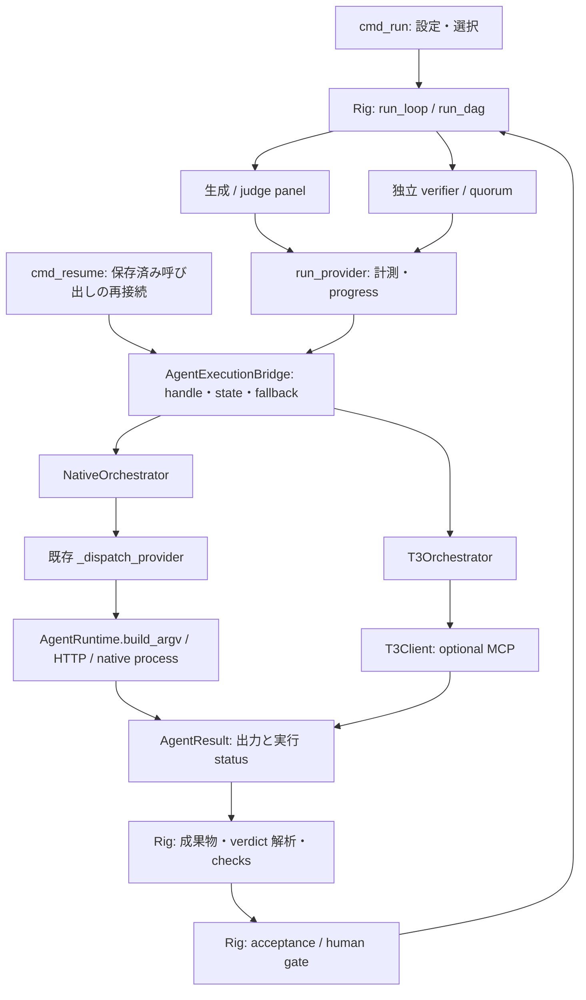

# #645: 差し替え可能な OrchestratorBackend の設計

決定: v0.1 は agent 呼び出しの委譲を対象とし、workflow の進行と採否の判定は Rig に残す。

状態: 実装前の仕様。作成日: 2026-10-05。調査対象: `feat/645-orchestrator-backend`、commit `e65a7e03`。

本書だけを今回の成果物とする。以下の変更ファイル、型、テスト、利用者向け文案は、後続実装の仕様であり、実装済みという意味ではない。

理由: optional な実行基盤を追加しても、既存の品質判定と Native-only の利用を維持するため。

却下した案: T3 に workflow 全体を移すこと、T3 を必須依存や LLM provider として追加すること。

目次:

1. [確認した前提とスコープ](#1-確認した前提とスコープ)
2. [差し込み口と判定権](#2-差し込み口と判定権)
3. [interface と capability](#3-interface-と-capability)
4. [T3 transport と互換性判定](#4-t3-transport-と互換性判定)
5. [選択と二段階の fallback](#5-選択と二段階の-fallback)
6. [run state と resume](#6-run-state-と-resume)
7. [doctor](#7-doctor)
8. [依存境界と構造テスト](#8-依存境界と構造テスト)
9. [manifest 検証](#9-manifest-検証)
10. [テスト計画](#10-テスト計画)
11. [利用者向けドキュメント](#11-利用者向けドキュメント)
12. [変更ファイルと実装順序](#12-変更ファイルと実装順序)

## 1. 確認した前提とスコープ

決定: Orchestrator・Runtime・Provider を別軸とし、通常の orchestrate 実行に最小の T3 接続を追加する。

| 軸 | 問い | 値・担当 |
| --- | --- | --- |
| Orchestrator | agent をどう走らせるか | `native` / `t3`。本仕様 |
| Runtime | 作業をどこで行うか | `--runtime auto\|native\|orca`、worktree の所有・作成・削除。#460/#461 |
| Provider | 誰が生成・検証するか | Claude / Codex など。モデル、role、独立性 |

理由: workspace の所有者と agent の実行基盤は独立して選べる。`NativeOrchestrator` の「常に利用可能」は adapter が組み込みであるという意味で、すべての provider のインストールや認証成功を保証しない。

却下した案: `--runtime t3`、`--provider t3`、既存の `backend` キーへの統合。既存の `backend` は複数の意味を持つため、新しい設定・state・telemetry のキーは `orchestrator` とする。

確認済みの根拠は、この commit の行番号で示す。依頼文にある行番号とは移動している。

| 確認済み | 根拠と設計への影響 |
| --- | --- |
| Issue の実本文を取得できた | `gh issue view 645`。共通 interface、optional T3、Rig の判定権、doctor が要求されている。[Issue #645](https://github.com/itoh-shun/rig/issues/645) |
| Runtime は worktree 専用の境界 | `rig_workbench/workbench/runtime.py:1`、`:67`、`:323`、`:376`。handle の `ref`、auto の理由付き fallback、明示指定の拒否、reconnect の4状態を前例にする |
| Orca の検出と CLI の稼働確認は別 | `rig_workbench/workbench/orca.py:108`、`:127`。`report()` は session を観測し、CLI は `observed: false` とする |
| 通常の provider 呼び出しの共通入口 | `rig_workbench/orchestrate/providers.py:501`、`:534`。計測と progress の内側に差し込める |
| Rig が実行・検証・gate を管理 | `rig_workbench/orchestrate/providers.py:1907`、`:2617`、`:2883`、`:3009`。DAG の gate 評価も同ファイル `:3061` にある |
| 通常の resume は verify-first | `rig_workbench/orchestrate/commands.py:714`、`:770`、`:798`。checks を再実行し `compute_next` を呼ぶ。通常の `run_loop` を再起動する処理ではない |
| strict は別の実行経路 | `rig_workbench/orchestrate/providers.py:2888`、`rig_workbench/orchestrate/deterministic_runtime.py:329`。`run_provider` の docstring の「すべて」はこの別経路まで含まない |
| 実行前の provider 構成を保存する場所がある | `rig_workbench/orchestrate/commands.py:1476`、`:1481`。ここで新しい選択結果も結び付ける |
| state の `execution` は厳密比較される | `rig_workbench/orchestrate/runstate.py:66`、`:110`。`execution` に追加すると整合性検査に失敗する。トップレベルの追加キーは許容される（`:237`、`:681`） |
| telemetry の `backend` は既存の区分 | `rig_workbench/orchestrate/runstate.py:399`、`:436`。値 `orchestrate` は維持する |
| manifest は信頼確認後に読み込む | `rig_workbench/orchestrate/recipes.py:556`。`.claude/rig.md` の frontmatter。値域検証は `rig_workbench/validation/manifest.py:204`、未知のトップレベルキーを一括拒否しない |
| 公開 CLI は `rig-wb` | `pyproject.toml:58`、`rig_workbench/cli.py:515`、`:689`。`rig-wb orchestrate` という中間サブコマンドはない |
| 新しい doctor の配線が必要 | `rig_workbench/cli.py:689` の dispatch と `rig_workbench/orchestrate/cli.py:132` に doctor はない。`hostcheck` は `rig_workbench/hostcheck.py:1440` に別コマンドとして存在する |
| MCP extra は既存 | `pyproject.toml:48` の `mcp>=1.28.1,<2`。本番の MCP client は未実装。`tests/test_remote_mcp.py:569` にサーバーテスト用 `ClientSession` は存在する |

v0.1 に含めるのは、Native の包み込み、選択、state、doctor、fake で検証できる T3 adapter と最小の streamable-HTTP client。通常の sequential / DAG / verifier panel を対象とする。本格的な T3 MCP adapter、lineage、provider の途中切替、child delegation、fork/merge、schedule、remote/mobile、trace の evidence 正規化、Orca との組合せ実測は follow-up。

strict と `secure_runtime` は v0.1 では Native 専用とする。前者には `StrictIO` の receipt 契約があり、後者には固定 executable・権限制約がある。auto では「この実行モードには T3 非対応」を選択理由として扱い、`fallback: none` または明示 `t3` なら実行前に拒否する。strict の実行器自体を今回の seam に移さない。Native-only の既存動作は維持し、T3 対応を装って制約を迂回しない。

## 2. 差し込み口と判定権

決定: B 案を採用し、`run_provider` の計測内から Orchestrator に委譲する。

| 案 | 利点 | 問題・採否 |
| --- | --- | --- |
| A: `run_loop` / `run_dag` / `cmd_resume` を丸ごと包む | workflow 単位で外部基盤に渡せる | step 遷移、retries、quorum、checks、gate の二重実装や判定権の混在を招く。却下 |
| B: `run_provider` → agent 実行の差し替え | 生成と verifier が同じ seam を通り、Rig の判定を保持できる | handle 保存と結果の再接続を agent 呼び出し単位で追加する必要がある。採用 |

理由: Issue の `spawn_agent` / `wait` / `collect_result` は agent 実行の interface である。step の採否を backend に渡さず、戻り値を既存の `(returncode, output)` に正規化すれば、thread 完了だけで Rig の gate を通せない。

却下した案: backend ごとに `run_loop` を実装すること、生成だけを T3 にして verifier の経路を例外扱いすること。



`run_provider` の引数・戻り値は維持する。二か所の `_dispatch_provider(...)` 呼び出しを共通 bridge 呼び出しに変える。bridge は `cfg` 内のプロセス限定オブジェクトとして注入し、cfg のコピーにも同一インスタンスを引き継ぐ。state に Python オブジェクトは保存しない。注入のない直接呼び出し（probe、単体テスト、workbench からの利用など）は Native を使い、T3 の auto-detection を始めない。

Native には既存 `_dispatch_provider` を callable として注入する。Native モジュールから `providers.py` を import する循環は作らない。CLI / HTTP / mock / custom command、session reuse、timeout、stdout/stderr、`RIG_PROVIDER_SUBPROCESS` の処理は既存 dispatcher に残す。benchmark の実呼び出し記録は bridge の各実行 attempt に一度だけ移し、Native 側で二重記録しない。progress と latency は既存 `run_provider` の枠を維持する。

Native callable は invocation ごとに既存 cfg/state を束縛する。これは Native 専用のプロセス内データであり、`AgentSpec` や T3 の引数へ cfg 全体をコピーしない。T3 には allowlist で投影した prompt・target・workspace・制約だけを送る。

生成側の `_generate` と verifier / judge panel / adaptive reviewer は引き続き `run_provider` を呼ぶ。T3 で generator が完了しても、verifier の出力を Rig が解析し、machine checks と human gate を含む既存手続きを経る。backend は `passed`、`done`、`verdicts`、`approvals` を直接書けない。

separation-of-duty は **provider identity** に対する既存ルールを保つ。確認済み: `agent_runtime.py:465` の `backend_for` は `rig` と `claude` の alias をまとめる。`providers.py:2442` の独立 review は同一 effective backend に対して明示された異なる model を要求する。ここに orchestrator 名 `t3` / `native` を入れない。T3 の provider instance は Rig provider/model に解決し、要求と実行時 identity が一致することを結果取り込み前に確認する。同一 provider を別 thread で動かした事実だけでは独立性を認めない。

T3 は呼び出しごとに新しい thread を作り、generator の会話履歴を verifier に継承しない。verifier 用の read-only 制約と既存の provider ごとの confinement を保持できることを起動前に確認する。要求を満たさない target、未知の identity、自動 provider/model 切替は拒否する。利用可能な別 provider への置換は行わない。

## 3. interface と capability

決定: 同期 Protocol と JSON 化可能な handle を用い、v0.1 の必須操作を availability・capability・spawn・wait・resume・cancel・collect に絞る。

理由: 既存 runner は同期関数と `ThreadPoolExecutor` を使う。async transport を core 全体へ伝播させる必要はない。task 自体は Rig run state に存在するため、外部 task の重複作成も要らない。

却下した案: 全メソッドを未実装 stub として公開すること、MCP の応答型や tool 名を core interface に漏らすこと、単一の `run()` だけにして外部 identity の保存時点を失うこと。

次の Python 3.10 互換の型を契約とする。`Mapping[str, object]` の永続化対象は JSON 値に限定する。token、client、lock、future、Native cfg は永続化しない。

```python
from dataclasses import dataclass
from typing import Literal, Mapping, Protocol

Capability = Literal[
    "agent.run", "agent.parallel", "agent.cancel",
    "thread.durable", "thread.resume", "delegate.child",
    "provider.switch", "fork_merge", "schedule",
]
OrchestratorName = Literal["native", "t3"]

@dataclass(frozen=True)
class Availability:
    ok: bool
    reason_code: str
    detail: str  # 秘密を除去した診断

@dataclass(frozen=True)
class TaskContext:
    run_id: str
    step_id: str
    invocation_id: str
    attempt: int
    cwd: str

@dataclass(frozen=True)
class AgentSpec:
    provider: str
    model: str | None
    role: str
    persona: str
    prompt: str
    timeout_s: float
    constraints: Mapping[str, object]

@dataclass(frozen=True)
class AgentHandle:
    orchestrator: OrchestratorName
    invocation_id: str
    ref: Mapping[str, object]

@dataclass(frozen=True)
class AgentStatus:
    phase: Literal["pending", "running", "completed", "failed", "cancelled"]

@dataclass(frozen=True)
class AgentResult:
    returncode: int
    output: str
    provider: str
    model: str | None

@dataclass(frozen=True)
class ReconnectResult:
    state: Literal["ready", "orchestrator_unavailable", "agent_missing", "unknown"]
    handle: AgentHandle | None
    status: AgentStatus | None
    detail: str

@dataclass(frozen=True)
class CancelResult:
    state: Literal["cancelled", "already_terminal", "unsupported", "unknown"]

class OrchestratorBackend(Protocol):
    name: OrchestratorName
    def available(self) -> Availability: ...
    def capabilities(self) -> frozenset[Capability]: ...
    def spawn_agent(self, task: TaskContext, agent: AgentSpec) -> AgentHandle: ...
    def wait(self, handle: AgentHandle, *, timeout_s: float) -> AgentStatus: ...
    def resume(self, handle: AgentHandle) -> ReconnectResult: ...
    def cancel(self, handle: AgentHandle) -> CancelResult: ...
    def collect_result(self, handle: AgentHandle) -> AgentResult: ...
```

`available()` は理由付きの値を返す。既存 Runtime の bool と `unavailable_reason` を一つの戻り値にまとめた形であり、`if availability.ok` と明示して読む。`capabilities()` は直近の probe 結果を参照するだけで新しい I/O を行わない。`wait` の timeout は秒で統一し、期限まで待ってなお実行中なら `running` を返す。通信故障は status に偽装せず後述の例外にする。`collect_result` は terminal の出力を読む冪等操作で、未完了なら `ResultNotReady`。

`create_task` は削除し `TaskContext` のローカル構築に統合する。`delegate` は v0.1 Protocol に入れず `delegate.child` の予約語だけ定義する。`resume` は既存 agent への再接続であり、新しい prompt の送信や再起動ではない。workflow の resume は引き続き Rig の責務である。

Native v0.1 の `spawn_agent` はプロセス内に pending 呼び出しを登録し handle を返す。実行は最初の `wait` が既存 dispatcher を同期的に一度だけ呼び、結果を cache する。呼出元の既存 thread pool が並列性を持つ。`ref` は空。`cancel` は未実行 pending の取り消しと terminal の no-op を実装し、実行中は `unsupported` を返す。既存 dispatcher の timeout 以上のプロセス制御は今回追加しない。

Native の bridge は従来どおり agent 全体の timeout で一度 `wait` する。短い poll は T3 にだけ用い、Native プロセスを短い poll のたびに作り直さない。Native の `wait` へ短い期限を指定した場合は dispatcher の timeout を残り時間以下に制限し、既存 timeout の失敗結果を返す。どちらの実装も、同じ handle への再度の `wait` / `collect_result` で再実行しない。

| capability | 意味 | Native v0.1 | T3 v0.1 |
| --- | --- | --- | --- |
| `agent.run` | 指定した provider/role で一回実行し出力を得る | true | 必須、対応 schema と制約を確認した場合だけ true |
| `agent.parallel` | 独立した複数 handle を同時に実行できる | true | adapter と probe が対応を確認した場合のみ true |
| `agent.cancel` | 実行中 agent に取り消しを要求できる | false | interrupt の契約を確認した場合のみ true |
| `thread.durable` | 再起動後も外部 identity と結果を読める | false | T3 利用の必須条件 |
| `thread.resume` | 保存済み thread/run へ副作用なく再接続できる | false | T3 利用の必須条件 |
| `delegate.child` | 親子関係付き委譲 | false | 宣言語彙のみ、実装せず false |
| `provider.switch` | 同一 task/thread の途中で provider を変更 | false | 宣言語彙のみ、実装せず false |
| `fork_merge` | thread の分岐と統合 | false | 宣言語彙のみ、実装せず false |
| `schedule` | 将来時刻の実行予約 | false | 宣言語彙のみ、実装せず false |

「宣言語彙のみ」は `capabilities()` の集合に含めないという意味である。T3 が広告していても Rig adapter が利用可能にしていない機能は true にしない。未知 capability は内部の診断用 metadata にだけ残し、core は分岐しない。`agent.parallel` がない backend は bridge 内の semaphore で直列化し、既存 DAG の依存関係・gate 順序は変えない。

provider/model/role/cwd/権限制約の互換性は `agent.run` だけでは表現できない。選択時に要求集合を検査し、動的に選ばれる provider は起動前にも検査する。不一致は `UnsupportedAgentSpec` として扱い、制約を削って実行しない。

## 4. T3 transport と互換性判定

決定: 注入可能な `T3Client` と遅延 import の streamable-HTTP client を採用し、tool 対応を一つの契約表に閉じ込める。

理由: 実サーバー未検証の API を core に固定せず、fake による Rig 側の契約検証と、実環境の互換性判定を分けるため。

却下した案: T3 CLI の存在だけで available と判定すること、MCP SDK の必須依存化、thread 内部用 token の流用、raw HTTP で MCP を独自実装すること、非対応時に任意の tool 名を推測して呼ぶこと。

```python
class T3Client(Protocol):
    def list_tools(self, *, timeout_s: float) -> Mapping[str, Mapping[str, object]]: ...
    def call_tool(self, name: str, arguments: Mapping[str, object], *,
                  timeout_s: float) -> Mapping[str, object]: ...
    def close(self) -> None: ...
```

既定実装 `McpT3Client` は初めて必要になった時だけ `[mcp]` extra の SDK を import する。SDK 1.x の `ClientSession` と streamable-HTTP transport を包み、async session の生成・使用・終了は専用 event-loop thread に集約する。同期呼び出しはそこへ submit し、既存 worker threads 間で async context を使い回さない。未設定/native なら loop thread 自体を作らない。終了時は session を閉じるが、接続の終了を外部 agent の cancel とみなさない。

確認済み: [MCP Python SDK](https://github.com/modelcontextprotocol/python-sdk) は client と streamable-HTTP を提供する。公開 main の例は SDK 2 系も含むため、そのまま転記せず、実装時に Rig の `<2` 制約内で検証する。今回 SDK の上限は変更しない。

| 設定 | 取得元と規則 |
| --- | --- |
| endpoint | 非空の `RIG_T3_MCP_URL` > trusted manifest の `orchestrator.t3.url`。完全な endpoint URL。自動 port 探索や暗黙の `/mcp` 追加はしない |
| bearer token | `RIG_T3_MCP_TOKEN` のみ。manifest の `token` / `headers` は拒否。state、telemetry、例外本文、doctor に token を出さない |
| project | 必要な場合は `RIG_T3_PROJECT_ID` > `orchestrator.t3.project_id`。候補が複数または対応不明なら選択不能。勝手に最初の project を使わない |
| probe 期限 | 全体で5秒。initialize、ページ分割された tools/list、read-only capability probe を含む。各段階へ残り時間を渡す |
| operation 期限 | agent 全体は既存 cfg の `timeout`（既定600秒）を利用。wait poll は最大5秒、秒→ミリ秒変換は対応表内だけで行う |

空の環境変数は未指定として扱う。URL は HTTPS、または loopback HTTP のみ許可し、userinfo・query・fragment は拒否する。redirect を追って bearer token を別 endpoint に渡さない。token は設定済み endpoint にのみ送る。設定値のエラー表示はキー名と理由に限定し、入力値の repr を出さない。T3 token を Native 子プロセスへ転送しない。

`available()` の定義は **有効な設定あり ∧ SDK import 可 ∧ probe 成功**。`probe_t3()` を select と doctor で共有する。SDK 不在、認証失敗、timeout、非対応 schema は理由コード付きで false。probe は tools/list の必要 tool と input schema を検査し、read-only capability 情報で target と制約を検査する。launch/configure/interrupt は診断では呼ばない。成功は接続と契約の互換性を示し、実 agent の実行成功を保証しない。

この SDK import 条件は既定 client に対する production 条件である。明示注入した fake client のテストでは SDK を必要とせず、SDK 不在の分岐は既定 client factory のテストで別に確認する。環境依存の暗黙の fake 選択は設けない。

対応表は `orchestrators/t3_contract.py` の `T3_TOOL_BINDINGS` 一か所に置く。値は tool 名、入力 encoder、schema 検査、応答 decoder の参照を持つ。以下は **Rig 内部の論理引数との対応を決める表であり、T3 の引数スキーマを確認済みとする表ではない**。

| 論理操作 | tool 候補 | Rig から渡す情報 / 必要な応答 | v0.1 |
| --- | --- | --- | --- |
| capabilities | `orchestrator_capabilities` | project / provider catalog、利用可能機能と制約 | probe 必須 |
| launch | `t3_thread_launch` | prompt、provider/model、role の制約、project、既存 cwd。thread id と **run id** | 実行必須 |
| configure | `t3_thread_configure` | thread と provider/model 設定 | 予約のみ。launch 後の権限制約変更には使わない |
| wait | `t3_thread_wait` | thread id、run id、残り時間 | 必須。run を固定し、latest を暗黙選択しない |
| read / collect / resume | `t3_thread_read` | thread id、run id、必要ならページ cursor。terminal status、完全な最終出力、実行 identity | 必須 |
| interrupt | `t3_thread_interrupt` | thread id、run id | v0.1 の T3 利用では必須。cancel の成否を確認する |
| list | `t3_thread_list` | project と検索条件 | 復旧診断用に必須。曖昧な候補を自動採用しない |
| delegate / batch | `delegate_task` / `create_threads` | 今回は送信しない | 予約のみ |

schema が変わっても論理契約が同じならこの対応表の encoder/decoder と fixture を更新する。意味が変わる場合は adapter の再設計が必要で、「表だけで任意の API に対応できる」とはしない。T3 の result truncation は成功扱いせず、pagination で完全な出力を取得できなければ結果取り込みを停止する。

確認済み（文書のみ）: [T3 の公開 Orchestrator MCP 文書](https://github.com/pingdotgg/t3code/blob/main/docs/orchestration-v2/orchestrator-mcp-server.md) は `t3_thread_launch`、既存 worktree への binding、wait/read/interrupt を記載し、launch には retry key がないと説明している。これは稼働確認ではない。

未確認: 外部向け `/mcp/external-read` / `/mcp/external-control` の既定無効・audience 別 bearer 認証、外部クライアントへの `thread_credential_required`、OAuth 別 PR、`t3_thread_configure` の契約は依頼時の調査情報であり、本調査で対象 build の実装と動作までは確認できていない。上記公開文書だけでは外部 endpoint の availability は立証できない。一般の `/mcp` に接続すれば外部実行できるとは仮定しない。

未確認: 正確な launch/result schema、外部 credential での project 指定、provider instance と Rig provider の対応、read-only verifier の強制、run を固定した完全な結果取得、同一 cwd の共有。最小 adapter の実装段階で対象 T3 revision と schema fixture を固定する。これらを満たさなければ probe または要求互換性検査を失敗させ、auto の Native-only 利用を可能に保つ。

workspace は Rig から渡された既存 cwd に固定する。T3 が独自 worktree を作る default は使わない。別マシンの同名パスを同じ checkout とみなさず、v0.1 は同一ホストまたは同一 checkout の共有を確認できる構成に限定する。確認できなければ非対応とする。これにより Rig が checks で検査する成果物と T3 が編集する成果物を一致させる。

## 5. 選択と二段階の fallback

決定: CLI > manifest > auto の順で選び、明示 t3 は降格せず、実行時 fallback は未起動が確定した呼び出しだけに許す。

理由: 外部実行を開始した可能性がある状態で Native を動かすと二重編集になる。明示指定は実行基盤に対する利用者の要求として扱う。

却下した案: あらゆる T3 エラーを Native で再試行すること、選択時だけ明示指定を尊重して実行時には黙って降格すること、`fallback: none` を認めず必ず Native を使うこと。

設定は `preferred: auto|native|t3`、`fallback: native|none`、既定は `auto` / `native`。CLI は `rig-wb run ... --orchestrator native|t3|auto`。CLI は preferred だけを override し、fallback は manifest から継承する。新しい fallback 用 CLI は作らない。`selected_by` は `cli|manifest|default|legacy`、実際の要求は別の `preferred` に保存する。

選択は `cmd_run` で一回行い、最初の agent 実行より前に保存する。直接 `run_loop` を使う既存 caller は未注入なら Native。T3 未設定の既定 auto は T3 モジュールや SDK を import せず、理由を出して Native へ進む。明示 native は T3 の設定検出・probe を行わない。

| 要求 | probe / 互換性 | fallback 設定 | 結果 |
| --- | --- | --- | --- |
| native | 問わない | native / none | Native、T3 probe なし |
| auto | 成功 | native / none | T3 |
| auto | 未設定・失敗・要求に非対応 | native | Native、理由を stderr へ |
| auto | 未設定・失敗・要求に非対応 | none | `OrchestratorUnavailable`、exit 2、agent 未起動 |
| t3 | 成功 | native / none | T3、実行時も降格しない |
| t3 | 失敗 | native / none | `OrchestratorUnavailable`、exit 2 |

`fallback: none` は auto に対する「T3 を使えなければ止める」指定になる。明示 native では fallback 自体が不要なので、この組合せも許す。

選択時メッセージは既存 runtime の前例に合わせる。

```text
◇ orchestrator auto: <redacted reason>; falling back to native
```

実行時の失敗分類は例外型で区別する。`AgentNotStarted`（副作用なしが確定）、`AgentStartUnknown`（送信済みか不明・応答喪失）、`AgentConnectionLost`（既知 handle の通信障害）、`OrchestratorUnavailable`（選択不能）を共通契約に定義する。失敗理由の文字列だけで分類しない。`UnsupportedAgentSpec` は起動前に限り `AgentNotStarted` と同じ扱いにする。

| 実行時の状況 | 対応 |
| --- | --- |
| request 送信前のローカル validation/import/接続確立失敗、またはサーバーが副作用なしを明示した拒否 | auto + fallback native の場合だけ、同じ provider/model/role/prompt/cwd の agent 呼び出しを Native で一度実行する。ログと state に記録 |
| 明示 t3、または fallback none で上記失敗 | 停止。Native を呼ばない |
| launch request 送信後の timeout、切断、壊れた応答、thread id はあるが run id がない | `AgentStartUnknown`。判明した id を保存し停止。id がないことは未起動の証明にならない |
| thread/run id 取得後の wait/read の失敗 | id を保持し `BLOCKED`。再接続待ち。Native fallback なし |
| agent の通常の失敗、非ゼロ rc、verifier FAIL、checks FAIL | Rig の既存 retries/gate の対象。transport fallback にはしない |
| agent 全体の timeout / 利用者の割り込み | cancel capability があれば既知の run を interrupt。未確認の停止を成功としない。結果不明なら `BLOCKED` と id を保持 |

実行中の pre-start fallback は **呼び出し単位**。run の選択 identity は t3 のままで、当該 invocation の実行者を native と記録する。別の T3 呼び出しが実行中でも、その handle を Native に付け替えない。同じ invocation の fallback は一度限りで、workflow の retry 回数を消費しないが実呼び出し計測には含める。以後の invocation は記録された選択に従う。

DAG / parallel 中に結果不明が生じたら新しい spawn を止め、他の起動済み handle を保存する。cancel 可能なものには停止を要求し、その成否も記録する。全 handle が terminal と確認できるまで checks・gate・自動 worktree teardown を行わない。未完了 future を単に捨てて「停止済み」とはしない。

## 6. run state と resume

決定: トップレベルの `orchestrator` に選択と呼び出し記録を保存し、resume は記録済み identity へ再接続する。

理由: `execution` の完全一致検証と既存 telemetry の意味を保ちつつ、backend 固有 metadata を workflow state から分離するため。

却下した案: `execution` 内への追加、外部 id を step の名前から再生成、resume 時の auto 再選択、workbench `task.json` と orchestrate state の同時移行。

通常の orchestrate `run-state.json` の例:

```json
{
  "orchestrator": {
    "schema_version": 1,
    "name": "t3",
    "selected_by": "default",
    "preferred": "auto",
    "fallback": "native",
    "capabilities": ["agent.run", "agent.parallel", "agent.cancel", "thread.durable", "thread.resume"],
    "invocations": {
      "call-001": {
        "step_id": "implement",
        "attempt": 1,
        "role": "generator",
        "persona": "implementer",
        "provider": "claude",
        "model": null,
        "orchestrator": "t3",
        "phase": "running",
        "result_applied": false
      }
    },
    "ref": {
      "t3": {
        "endpoint": "http://127.0.0.1:3773/mcp/external-control",
        "project_id": "project-123",
        "contract_version": "rig-t3-v1",
        "threads": {
          "call-001": {"thread_id": "thread-123", "run_id": "run-456"}
        }
      }
    }
  }
}
```

`name` はその run が選んだ orchestrator。実行中 fallback がある run は `invocations[*].orchestrator` と fallback event を見て実際の担当を判別する。これは「全呼び出しが t3 だった」という証明ではない。T3 固有 id、endpoint、project、schema 情報は `ref.t3` にのみ置き、core はそれらを解釈せず T3 adapter に渡す。Native の `ref` は `{}`。token は常に現行の環境変数から読み直す。

`invocations` は core 共通の実行台帳。`invocation_id` は run 内で一意に事前割当し、同じ step / attempt / role の panel メンバーを persona と連番で区別する。曖昧な prompt hash だけを id として使わない。call ごとに consumer 種別、入力成果物の hash、出力の保存先、実行 identity も必要な時点で追加する。JSON の例は running 状態の最小形である。取得済み結果は既存 artifact 保存規則に従って格納し、その参照と hash を台帳に保存する。

T3 を選んだ run の保存順序と故障時の扱い（Native への call 単位 fallback もこの台帳で追う）:

1. selection と `invocation_id`、consumer、入力 binding を保存する。`intent` → `starting` を保存してから launch を送る。
2. launch 応答の id は、wait や別の spawn に進む前に handle として保存する。id の受信直後に crash した場合でも、disk 上の `starting` は「未起動」には戻らない。
3. wait が terminal を返しても Rig の verdict は書かない。結果を保存し、実行 identity・出力の完全性・入力 hash を検証する。
4. 既存の生成結果処理または verifier 解析を行い、取り込み済み marker と workflow の更新を同一 snapshot に保存する。`result_applied` により二重 verdict や二重 artifact 適用を防ぐ。
5. gate は取り込み後に既存の Rig の計算から決まる。接続障害は `stopped.kind = "BLOCKED"`、`stopped.source = "orchestrator"` とし、該当 invocation と理由コードを持たせる。

保存 coordinator は run ごとに lock を持ち、parallel handle 更新と runner の checkpoint を同じ lock で直列化する。T3 では起動前 intent と受信済み id を一貫した snapshot として永続化する必要がある。確認済み: `runstate.py:289` の通常保存は secure 分岐と同一の atomic 処理ではないため、T3 に必要な atomic snapshot 保存を既存の所有者・symlink 拒否条件を維持して追加する。保存に失敗したら新規 spawn と fallback を止め、取得済み id を秘密抜きで stderr にも報告する。state に token や完全な cfg を保存して復旧しようとはしない。

T3 の実行には永続 state path を必須とし、保存先を用意できなければ launch 前に拒否する。同一 run への別プロセスの run/resume も排他 lease で拒否し、プロセス内 lock だけで十分とはしない。snapshot の temp 書込み・fsync・rename・親 directory の fsync を一連の保存として扱う。id 受信と disk 保存は外部サーバーと atomic にはできないため、その間の crash は保存済み `starting` から `unknown` に復旧する。

Native-only run は選択情報と従来の step checkpoint を永続化し、`invocations` と `ref` は空にする。Native の transient handle を durable として保存せず、従来の verify-first resume を追加の「実行結果不明」で止めない。上記の Native 未解決状態とは、T3 run の fallback として台帳に残した Native attempt を指す。

旧 state は `orchestrator` キーがなければ Native と解釈する。読み取りだけでファイルを書き換えない。再開して次に保存する場合は `selected_by: legacy`、`preferred: native` として明示化できる。キーが存在するが壊れている場合や未知 schema は legacy 扱いせず `BLOCKED`。

resume では CLI / manifest / 現在の auto 設定より **保存済み name** が優先される。`--orchestrator` は `run` 専用で、`resume` に渡すと「既存 run の基盤変更はできない」と exit 2。記録した endpoint と現在の endpoint が異なる場合も停止し、同じ thread id を別サーバーで検索しない。credential の交換は可能だが namespace と project の一致確認を必要とする。

| reconnect state | 意味 | resume の対応 |
| --- | --- | --- |
| `ready` | 記録した基盤へ接続でき、対象 agent を確認した。旧 Native で未解決 handle がない場合もこれ | status に応じて待機を報告、または結果を取得 |
| `orchestrator_unavailable` | SDK / endpoint / 認証 / backend 実装が利用不可 | state を保持し exit 2。fallback なし |
| `agent_missing` | 対象 namespace への問い合わせが成功した上で、保存 id が存在しない | state を保持し exit 2。新規 thread を作らない |
| `unknown` | launch 成否不明、結果欠損、保存済み Native 呼び出しの実行結果不明など | state を保持し exit 2。自動再実行しない |

これは Runtime の4状態を参考にした別の語彙であり、`workbench.runtime.reconnect` は呼ばない。Native のプロセス内 pending/terminal handle は利用できるが、プロセス再起動後に未解決の Native agent を durable に再接続できるとはしない。保存済みの取り込み済み結果は通常の verify-first resume に進める。

T3 resume はまず未解決 invocation を照合する。まだ running なら status を保存して exit 1 とし、checks を外部編集と並走させない。terminal なら元の consumer に一度だけ結果を渡す。`starting` のままで id が不明なら、list の候補を診断として示すだけで自動再 launch や候補 thread の採用はしない。id を確実に結び付ける自動 lineage 復旧は follow-up。

通常 `cmd_resume` の意味は保つ。新しい生成や verifier を自動起動するループにはせず、結果取り込み後に既存の verify-first checks と `compute_next` を呼ぶ。未実施の検証があれば次の必要な action を返す。Orchestrator 起因の `BLOCKED` は再接続と整合性確認が成功した場合だけ解除し、policy/gate 由来の停止を消さない。strict state は従来の `resume_strict` に任せる。

telemetry `runs.jsonl` は有効な記録がある時だけ `"orchestrator": state["orchestrator"]["name"]` を追加する。既存の `"backend": "orchestrate"` は変更しない。legacy state を単に表示・集計する際に架空の測定値は補わない。呼び出し単位の fallback は履歴の `ORCHESTRATOR_FALLBACK`（invocation、from/to、理由）で追跡し、telemetry にも fallback 件数を条件付きで付ける。外部 thread id や endpoint/token は telemetry に転記しない。

workbench の `.rig/runs/<id>/task.json` は今回スコープ外。`WorktreeHandle.ref`、`--runtime`、accept/discard の所有権規則は変更しない。

## 7. doctor

決定: 読み取り専用の `rig-wb doctor [--json] [--orchestrator auto|native|t3]` を独立コマンドとして追加する。

理由: インストールされる CLI は `rig-wb` で、Orca の環境情報も並べる診断は orchestrate の中だけに置くよりトップレベルが適する。hostcheck は `[OK]/[MISS]` と終了コードによるゲート、履歴保存の用途を持つ。

却下した案: 存在しない `rig-wb orchestrate doctor` を導入すること、hostcheck に追加して optional T3 不在を MISS にすること、`pack doctor` に混ぜること。

確認済み: `rig_workbench/cli.py:789` は orchestrate verb を委譲する構造である。一方 doctor は `rig_workbench/doctor.py` へ独立 dispatch する。`hostcheck.py:1440` の記録機能は利用しない。

doctor は trusted manifest と環境変数を読み、select と同じ設定解決・`probe_t3()`・選択判断を dry-run で行う。manifest の信頼確認で trust store を更新したり対話的 consent を記録したりしない。未信頼 manifest は無視した旨を表示する。launch、configure、interrupt、provider 実行、worktree 作成、state/telemetry/診断 cache の書き込みはしない。明示 native の診断では T3 probe を省略し、`not probed (native requested)` と表示する。

確認済み: `recipes.py:224` は環境変数による consent でも trust store に書く。このため既存 `load_manifest()` をそのまま doctor から呼ばず、同ファイルの trust/read 処理に `read_only=True` を追加する。既定値 false の既存呼び出しは変えず、doctor は保存済み hash と一致する manifest だけを読む。診断 Presenter を注入して trust 警告も JSON の reason に収める。

```text
Execution backends

✓ Rig Native Runtime (orchestrator: native)
✓ T3 Code
  └─ MCP connected; compatible contract; live execution unverified
○ Orca (workspace runtime)
  └─ not detected; CLI not probed

Active orchestrator: T3 (selection for a new run)
Fallback: Native (auto, confirmed pre-start failure only)
```

`Active` は進行中 run の観測ではなく、この設定で新規 run を開始した時の選択結果と明記する。provider/recipe を診断入力に持たないため、個別実行の role/cwd 互換性までは保証しない。明示 t3 が unavailable なら `Active orchestrator: unavailable`、fallback は `disabled by explicit t3`。auto + none の選択失敗も unavailable。

Orca 行はトップレベル doctor が `workbench.orca.report()` を呼び、戻り値をそのまま診断データに含める。session の存在と CLI の到達性を別項目として表示する。環境変数があるだけで `MCP connected` や「Orca 利用可能」とは表示しない。

JSON は `schema_version`、`execution_backends.native/t3`、`workspace_runtimes.orca`、`selection`、`errors` を持つ。availability は `available: true|false|null`（null は未 probe）、`reason_code`、`detail`、`capabilities`。selection は `preferred`、`selected_by`、`active`（選べなければ null）、`fallback`、`effective_fallback`。`--json` の stdout は JSON 一つだけとし、通常 select の fallback メッセージは出さず reason に収める。

doctor の診断結果による exit code は常に 0。設定不正、SDK 不在、認証失敗、timeout、選択不能も `errors` と診断行に表す。引数解析エラーも doctor の診断として exit 0 で返す。`--help` も 0。signal による強制終了まで成功に偽装する契約ではない。

## 8. 依存境界と構造テスト

決定: Orchestrator から workbench runtime を参照せず、Native と未設定 auto の経路から T3 import を排除する。

理由: optional integration の故障が既定利用を壊さないことを、コメントではなく構造と実行の両方で固定するため。

却下した案: eager な backend instance registry、`__init__.py` での T3 再 export、`AgentRuntime` と workspace runtime の統合。

新モジュール群は `rig_workbench/orchestrate/orchestrators/`。`base.py`、`native.py`、`bridge.py`、`selection.py` と、遅延読込対象の `t3.py`、`t3_client.py`、`t3_contract.py` に分ける。`__init__.py` は軽量に保つ。selection は T3 設定と要求モードを標準ライブラリだけで確認してから `_load_t3()` 内で import する。default auto は **未設定なら** T3 コードを読まない。設定あり auto で T3 を選ぶ処理は optional integration の経路である。

`agent_runtime.py` の #416 Phase 3 は vendor 単位の実プロセス run/stream/abort の将来抽象で、`NativeOrchestrator` は複数の agent 呼び出しを扱う adapter である。今回は argv adapter を改名・統合せず、Native から従来の `_dispatch_provider` を利用する。将来 Phase 3 が実装されたら Native の委譲先を置換できる。現時点で streaming や abort を実装したとは主張しない。

確認済み: `tests/test_runtime_backend.py:250` に runtime/provider 分離の検査、`:258` に provider 側の workspace runtime 参照禁止がある。追加する AST 検査は相対 import を完全名に解決し、関数内の `Import` / `ImportFrom` も含む。

| 検査対象 | 拒否する依存 |
| --- | --- |
| `orchestrators/**.py` 全体 | `rig_workbench.workbench.runtime` / `orca`、`WorktreeBackend` / `WorktreeHandle` の import。cwd は引数で受け取る |
| base / native / bridge | t3 modules、`mcp` の直接・間接 import |
| selection と package initializer | module scope の T3 import。T3 import は設定確認後に呼ばれる `_load_t3()` だけ許可 |
| t3_client 以外 | SDK `mcp` import。t3_client でも factory 内でのみ許可 |

AST は literal な動的 import (`importlib.import_module` / `__import__`) も検査し、計算した名前による dynamic import を新 package 内で禁止する。コメント・docstring にある用語は依存に数えない。さらに fresh Python process の import blocker と `sys.modules` 検査で、native と未設定 auto の実行が T3 / SDK に到達しないことを確かめる。doctor の `orca.report()` import は package 外の診断 composition に限定する。既存 `test_layering_contract.py` の層規則も維持する。

確認済み: `tests/test_layering_contract.py:20` は judgement 層から別 pillar・第三者ライブラリへの import を禁じ、shell を閉じたリストで宣言する。SDK を直接使う `orchestrators.t3_client` だけを transport adapter として理由付きで shell 登録し、base/native/bridge/t3 の一括除外はしない。設定 validator は同じ orchestrate pillar 内に置く。validation からは既存の `validation/rig_surfaces.py` を介し、manifest 側の狭い Protocol へ注入する。

## 9. manifest 検証

決定: `orchestrator` 内は型・値域・未知キーを厳格に検証し、未知のトップレベルキーに関する既存規則は変えない。

理由: 任意の T3 引数や token の透過転送を防ぎ、`prefered` のような typo が auto に化けることを避けるため。

却下した案: 未知の orchestrator subkey を無視すること、検証失敗を接続失敗とみなして Native に降格すること、manifest から任意の tool mapping や header を受け付けること。

```yaml
orchestrator:
  preferred: auto
  fallback: native
  t3:
    url: http://127.0.0.1:3773/mcp/external-control
    project_id: project-123
```

| キー | 検証と既定 |
| --- | --- |
| `orchestrator` | 未指定なら既定設定。指定時は mapping 必須。null / list / bool / string は拒否 |
| `preferred` | 文字列 `auto` / `native` / `t3`。省略時 auto |
| `fallback` | 文字列 `native` / `none`。省略時 native。YAML null は none の代用にしない |
| `t3` | 省略可。指定時は mapping、許可キーは `url` / `project_id` のみ |
| `t3.url` | 非空文字列。第4節の URL 制約。省略して環境変数から供給してよい |
| `t3.project_id` | 非空で制御文字を含まない文字列。省略可だが外部 API が要求する場合は probe で不足を報告 |
| その他の subkey | 拒否。とくに `token` / `headers` / `tools` / `args` を受け付けない |

純粋関数 `validate_orchestrator_config(value)` を SDK と無関係な `rig_workbench/orchestrate/orchestrators/config.py` に置く。`validation/manifest.py:204` は `rig_surfaces` 経由で得た violations を既存の FAIL として報告する。`recipes.load_manifest()` の既定の trust 規則は維持し、run の設定解決側でも同じ validator を呼ぶ。CLI native による override でも trusted manifest の不正を隠さない。run は exit 2、doctor は診断して exit 0。

manifest が未設定でも、env の URL/token により auto は T3 を検討できる。token がなく URL だけ存在するなどの接続設定不足は malformed manifest ではなく unavailable として、第5節の選択表に従う。CLI `--orchestrator` の無効値・値欠落は run では exit 2。

## 10. テスト計画

決定: Native 回帰・fake T3・故障境界・復旧・診断・構造を自動テストし、selftest には Native の契約だけを追加する。

理由: 実 T3 サーバーの有無に CI を依存させず、fallback と Rig の判定権を再現可能に検証するため。

却下した案: Native/T3 の成功だけを試すこと、fake 成功を実サーバー検証済みと記載すること、標準 selftest にネットワーク接続や有料 provider 呼び出しを入れること。

テスト名は既存 `tests/test_orca_runtime.py:42` などと同様、振る舞いを文として読む `test_...` とする。新規 file 内の fake は `T3Client` を実装し、tool catalog、identity、起動前拒否、起動後切断、応答喪失、terminal result を制御する。

| ファイル | テスト名 | 確認する振る舞い |
| --- | --- | --- |
| `tests/test_orchestrator_backend.py` | `test_native_keeps_existing_provider_outputs_timeouts_and_progress` | CLI / HTTP / mock / custom command の結果と既存 progress・計測を保持 |
| 同上 | `test_unconfigured_auto_uses_native_without_loading_t3` | Native-only 環境で既存実行が完結、理由は stderr |
| 同上 | `test_explicit_native_never_probes_t3` | T3 設定済みでも native 指定は probe なし |
| 同上 | `test_cli_choice_overrides_manifest_and_default` | 優先順位、selected_by と preferred |
| 同上 | `test_auto_selects_a_compatible_t3_client` | fake で auto が T3 を選択 |
| 同上 | `test_generators_and_all_verifiers_use_the_selected_orchestrator` | sequential / DAG / panel / adaptive の両 role が seam を通る |
| 同上 | `test_a_serial_backend_preserves_dag_dependencies_and_gate_order` | parallel capability がない場合の直列化 |
| 同上 | `test_strict_and_secure_runs_require_native_without_weakening_constraints` | auto+native fallback、明示 t3 / fallback none 拒否、既存 strict resume |
| `tests/test_t3_orchestrator.py` | `test_probe_requires_configuration_sdk_tools_and_compatible_schemas` | URL/token、SDK 不在、必要 tool 欠落、schema 不一致 |
| 同上 | `test_probe_is_bounded_and_never_starts_or_changes_a_thread` | 全体5秒、read-only calls のみ |
| 同上 | `test_tool_bindings_pin_the_workspace_provider_and_external_run` | cwd、provider/model、role、thread/run id の対応 |
| 同上 | `test_unverified_provider_or_verifier_confinement_is_refused_before_launch` | identity と権限制約の不明を成功扱いしない |
| 同上 | `test_mcp_client_uses_one_owned_event_loop_and_closes_its_session` | concurrent fake SDK と cleanup、SDK import の遅延 |
| 同上 | `test_probe_failure_falls_back_to_native_only_when_auto_allows_it` | 未設定、認証失敗、timeout で native / none を比較 |
| 同上 | `test_confirmed_pre_start_failure_retries_the_same_call_once_on_native` | 引数同一、二重計測なし、fallback event 保存 |
| 同上 | `test_explicit_t3_never_downgrades_even_with_native_fallback_configured` | 選択時と実行時両方の明示指定 |
| 同上 | `test_a_lost_launch_response_blocks_without_starting_native` | id 不明でも起動後の可能性があれば停止 |
| 同上 | `test_failure_after_launch_preserves_ids_and_blocks_new_work` | id 保存、spawn 停止、worktree teardown なし |
| 同上 | `test_agent_failure_and_failed_checks_are_not_transport_fallbacks` | agent rc / checks / verifier FAIL は Rig の処理 |
| 同上 | `test_cancel_failure_keeps_the_external_run_unresolved` | timeout、interrupt、cancel unknown を成功扱いしない |
| 同上 | `test_completed_threads_do_not_bypass_rig_acceptance_or_human_gates` | completed + verifier FAIL、checks FAIL、human gate 未承認では accepted にならない |
| 同上 | `test_t3_does_not_launder_provider_aliases_or_change_review_identity` | `backend_for`、異なる model の既存条件、実行 identity 不一致 |
| 同上 | `test_truncated_or_wrong_run_output_is_not_collected_as_a_result` | 完全な pinned run 出力だけ取り込む |
| `tests/test_orchestrator_state.py` | `test_selected_identity_and_external_thread_ids_survive_round_trip` | `save_state` / `load_state` で identity と ref を保持 |
| 同上 | `test_orchestrator_metadata_does_not_change_execution_policy` | execution 完全一致と新しいトップレベルキーの両立 |
| 同上 | `test_missing_orchestrator_means_legacy_native_but_malformed_data_blocks` | 旧 state と壊れた新 state の区別 |
| 同上 | `test_concurrent_handles_and_fallbacks_keep_distinct_invocation_records` | panel / DAG の lock と call ごとの実行 identity |
| 同上 | `test_launch_intent_and_handle_are_durable_before_execution_continues` | launch 前と wait 前の保存順序、書込み failure 時の停止 |
| 同上 | `test_a_second_process_cannot_resume_a_run_with_an_active_owner` | 同一 run のプロセス間排他、停止後の lease 解放 |
| 同上 | `test_resume_reconnects_the_recorded_backend_and_never_reselects` | manifest/CLI/env 変更、backend unavailable、endpoint 不一致 |
| 同上 | `test_reconnect_distinguishes_ready_unavailable_missing_and_unknown` | 4状態と Native 未解決実行 |
| 同上 | `test_resume_does_not_check_a_workspace_while_its_agent_is_running` | 外部編集と checks の競合防止 |
| 同上 | `test_resume_applies_a_result_once_then_keeps_verify_first_semantics` | 二重結果適用なし、未実施 verifier/gate を省略しない |
| 同上 | `test_telemetry_adds_orchestrator_without_changing_backend` | legacy では省略、fallback 件数、秘密・外部 id を含めない |
| `tests/test_doctor.py` | `test_doctor_reports_native_t3_and_both_orca_axes_without_writes` | human 出力と読取り専用、trust/state/log を変更しない |
| 同上 | `test_doctor_json_matches_the_shared_selection_without_stdout_noise` | JSON schema と通常 select の判断が一致 |
| 同上 | `test_doctor_exits_zero_for_unavailable_invalid_and_unconfigured_backends` | native / T3 available / failure / 不正設定の exit 0 |
| 同上 | `test_doctor_never_discloses_tokens_or_probes_t3_for_explicit_native` | 秘密を含めない、probe 省略が明示される |
| `tests/test_manifest_check.py`（既存に追加） | `test_orchestrator_accepts_only_declared_values_and_subkeys` | 全 enum、型、unknown、token、headers、URL 検証を parameterize |
| 同上 | `test_orchestrator_defaults_do_not_change_other_manifest_keys` | 未設定と既存 default_backend の互換性 |
| `tests/test_orchestrator_boundaries.py` | `test_orchestrators_never_import_workspace_runtimes` | AST で相対・絶対・関数内 import を検査 |
| 同上 | `test_native_and_core_never_import_t3_or_mcp` | T3 は限定 loader、SDK は client factory だけ |
| 同上 | `test_fresh_native_and_unconfigured_auto_processes_do_not_load_optional_modules` | import blocker による推移的な依存漏れの検出 |
| `tests/test_cli_smoke.py`（既存に追加） | `test_doctor_and_orchestrator_options_are_reachable_and_documented` | top-level doctor、run flag、help、resume の変更拒否 |

既存 `test_runtime_backend.py`、`test_orca_runtime.py`、`test_resume.py`、`test_provider_subprocess_env.py`、`test_orchestrate_timeout.py`、`test_layering_contract.py` は回帰対象。CLI の公開 verb 一覧との整合は `test_capability_registry_vs_cli.py` も確認する。

`rig_workbench/orchestrate/selftest.py` には、明示 native + mock で従来の遷移が同じこと、旧 state が native と読めること、新 metadata が execution 判定を変えないことの短い deterministic case を追加する。標準 selftest は環境の T3 設定を読まず native を固定する。T3 fake の故障 matrix は pytest に置く。

実装後の検証は変更した module の pytest、既存回帰群、全 pytest、既存 selftest の順。実 T3 の smoke は別の opt-in 手順とし、サーバー revision、SDK version、公開 tool schemas、起動・collect・interrupt・reconnect と role 制約の観測結果を記録する。それが揃うまでは「fake で契約確認済み／実 T3 未検証」と表示し、実サーバー対応済みとリリースノートに書かない。

## 11. 利用者向けドキュメント

決定: `docs/orchestrators.md` に三軸の違いから説明し、実 T3 未検証と fallback の停止条件を明示する。

理由: 「T3 が optional」と「失敗なら常に Native で続く」は同じではない。利用者が接続設定と復旧手順を判断できる必要がある。

却下した案: 一般的な T3 の紹介だけを書くこと、接続確認を実 execution 検証と呼ぶこと、CHANGELOG で既存 runtime 統合とまとめること。

新規 `docs/orchestrators.md` の章立て:

1. 冒頭: **Orchestrator（どう走らせるか）≠ Runtime（どこで）≠ Provider（誰が）** の表。第1節の三軸と CLI を説明。
2. Native だけで使う: 無追加依存、未設定 auto、`--orchestrator native`、既存 provider と gate。
3. 設定: CLI > manifest > auto、fallback native/none、明示 t3 は降格しない。
4. T3 を接続する: `[mcp]`、URL/token/project の取得元、trusted manifest、対象 build/schema、token を保存しない設定例。
5. 利用可能な capability と制限: v0.1 対応、strict/secure Native 専用、verifier identity と confinement、同一 checkout。
6. `rig-wb doctor`: text/JSON、Active の意味、Orca の二軸、常に exit 0、読み取り専用。
7. 失敗と復旧: probe 失敗、未起動確定、起動不明、既知 id、記録済み backend への resume。手動で state の name を書き換えることを復旧手順にしない。
8. state と telemetry: `orchestrator`、`ref`、call 単位 fallback、既存 `backend` の維持、legacy。
9. 検証範囲と follow-up: fake と実機の区別、実サーバー smoke 記録、lineage/delegation/fork/schedule の対象外。

実機未検証の定型文案:

> T3 連携は実験的です。Rig 側の選択・状態保存・障害処理は fake client で検証する設計ですが、実 T3 サーバーでの起動・権限制約・結果取得・再接続は未検証です。doctor の `MCP connected` は接続と API 契約の確認を示し、agent 実行の成功や Rig の acceptance を示しません。対応する API 契約を確認できない環境では T3 を選択せず、設定に従って Native に戻るか停止します。

`CHANGELOG.md` の Unreleased / Added に入れる文案（**後続実装と fake テスト完了後**に使用）:

> Agent 実行を差し替える OrchestratorBackend を追加しました。組み込みの NativeOrchestrator は従来の provider 実行を維持し、任意の T3 接続は `orchestrator` 設定と `--orchestrator` で選択できます。run state に実行基盤と外部 thread/run id を保存し、`rig-wb doctor --json` で接続と選択を診断できます。T3 の完了後も verifier・checks・acceptance gate は Rig が判定します。auto の Native fallback は未起動が確定した場合に限り、明示 t3 と起動後の障害では自動降格しません。T3 は実験的で、fake client による契約テストのみ確認済み、実 T3 サーバーでは未検証です。

## 12. 変更ファイルと実装順序

決定: Native の包み込みから始め、state・fake T3・transport・doctor の順で小さく検証する。

理由: 外部 API の不確実性と既存実行の移行を分離し、各段階で Native の回帰を検出するため。

却下した案: CLI、state、T3、Runtime を一括置換すること、実 T3 の API 確定まで Native の境界設計を保留すること。

後続実装で変更するファイル一覧:

| ファイル | 変更内容 |
| --- | --- |
| `rig_workbench/orchestrate/orchestrators/config.py`（新規） | SDK 不要の設定型、値域・URL検証、既定値 |
| `rig_workbench/orchestrate/orchestrators/__init__.py`（新規） | optional import を起こさない package |
| `rig_workbench/orchestrate/orchestrators/base.py`（新規） | Protocol / dataclass / capability 語彙 / 例外 |
| `rig_workbench/orchestrate/orchestrators/native.py`（新規） | 注入 dispatcher の wrapper、プロセス内 handle |
| `rig_workbench/orchestrate/orchestrators/bridge.py`（新規） | call identity、保存 coordinator、結果取り込み、fallback、再接続 |
| `rig_workbench/orchestrate/orchestrators/selection.py`（新規） | 選択表、probe 結果、遅延 factory、dry-run 診断 |
| `rig_workbench/orchestrate/orchestrators/t3.py`（新規） | `T3Orchestrator`、logical operations、結果/故障分類 |
| `rig_workbench/orchestrate/orchestrators/t3_client.py`（新規） | `T3Client` と MCP SDK 1.x client、token・session 管理 |
| `rig_workbench/orchestrate/orchestrators/t3_contract.py`（新規） | 唯一の tool/schema/引数/応答対応表 |
| `rig_workbench/orchestrate/providers.py` | run_provider の委譲、共通結果 consumer、parallel の停止と checkpoint、計測維持 |
| `rig_workbench/orchestrate/commands.py` | run flag、実行前選択と注入、resume reconcile、未解決時の teardown 抑止、strict/secure の事前拒否 |
| `rig_workbench/orchestrate/runstate.py` | トップレベル新 schema、legacy 読取、永続化、条件付き telemetry。execution の内容は変更しない |
| `rig_workbench/orchestrate/agent_runtime.py` | Phase 3 と NativeOrchestrator の関係を docstring に追記。argv や backend_for の意味は維持 |
| `rig_workbench/validation/manifest.py` | 共通 validator の violations を FAIL に接続 |
| `rig_workbench/validation/rig_surfaces.py` | orchestrate の validator を manifest の Protocol に接続 |
| `rig_workbench/orchestrate/recipes.py` | doctor 向け read-only trust/read。既存の既定動作は維持 |
| `rig_workbench/doctor.py`（新規） | read-only 診断、JSON、Orca report の composition |
| `rig_workbench/cli.py` | doctor dispatch と help |
| `rig_workbench/registry/entries_cli.py` | doctor と run の新 flag を公開 capability registry に登録。doctor は read-only、network sometimes、exit 0 |
| `rig_workbench/orchestrate/cli.py` | run の orchestrator option と resume 制約の help |
| `rig_workbench/orchestrate/selftest.py` | Native 固定の deterministic case |
| 第10節の新規5テストファイルと既存2ファイル | 振る舞い・state・doctor・validation・CLI・構造のテスト |
| `tests/test_layering_contract.py` | MCP client だけを理由付き transport shell として登録。依存禁止規則は維持 |
| `docs/orchestrators.md`（新規） | 第11節の利用者向け説明 |
| `CHANGELOG.md` | Unreleased / Added の文案を実装済み内容に合わせて追加 |

テストの新規ファイルは `test_orchestrator_backend.py`、`test_t3_orchestrator.py`、`test_orchestrator_state.py`、`test_doctor.py`、`test_orchestrator_boundaries.py` の5つ。既存の振る舞いテストへの追加は `test_manifest_check.py` と `test_cli_smoke.py`。CLI registry と help の一致は既存 `test_capability_registry_vs_cli.py` で検証し、doctor を未文書化 verb の例外に追加しない。

`pyproject.toml` の MCP 必須依存化は不要。`workbench/runtime.py`、`workbench/orca.py`、`hostcheck.py`、workbench `task.json` は変更対象外。通常 resume の拡張に必要な結果 consumer は既存生成・verifier 処理から抽出し、判定規則を複製しない。

| 段階 | 実装単位 | 完了条件 |
| --- | --- | --- |
| 1 | 純粋設定 validator、共通型、Native wrapper、seam | 明示 native で全既存 provider 経路と計測が維持される。T3 import なし |
| 2 | invocation 台帳、保存 coordinator、legacy と resume の契約 | crash 境界・並列・結果一度適用・execution 不変のテストが通る |
| 3 | selection と注入 T3 fake、capability 分岐、二段 fallback | available / pre-start / ambiguous / post-start と Rig gate の matrix が通る |
| 4 | tool 対応表、SDK 1.x transport、bounded probe | fake SDK の lifecycle と schema fixture 検証。未確認の外部契約は unavailable のままにする |
| 5 | run CLI / resume / doctor / manifest 配線 | 公開 CLI、JSON、exit codes、read-only、Orca 二軸表示、構造テストが通る |
| 6 | selftest、利用者 docs、CHANGELOG | 全 pytest と Native selftest が通り、実機未検証の範囲が文書と一致する |

実サーバー検証を実施する場合は段階4以降の opt-in とし、確認できた revision・schema・role/cwd 制約を fixture と docs に反映する。未確認事項は silent fallback や楽観的な capability 宣言で埋めない。

## 13. v0.1 の実装範囲（親が確認して確定）

決定: 上記設計のうち、次の4点を v0.1 から外して follow-up に回す。それ以外は設計どおり実装する。

1. **プロセス間の排他 lease は入れない。** `test_a_second_process_cannot_resume_a_run_with_an_active_owner` は作らない。プロセス内 lock と atomic snapshot 保存（temp 書込み → fsync → rename）は入れる。
2. **T3 の `agent.parallel` は v0.1 では常に false。** T3 選択時の invocation は bridge の semaphore で直列化する。DAG の依存と gate 順序は変えない。結果不明や起動後の失敗が起きたら新しい spawn を止め、判明した id を保存して `BLOCKED` にする。並列 handle の一括 cancel は作らない。
3. **resume では結果を自動で取り込まない。** 記録済みの orchestrator に再接続し、4状態（ready / orchestrator_unavailable / agent_missing / unknown）と外部 id を報告するだけにする。未解決の T3 invocation が残っていれば exit 2 で止め、新規 thread も Native 実行も起こさない。未解決が無ければ従来の verify-first resume に進む。`test_resume_applies_a_result_once_then_keeps_verify_first_semantics` は「未解決の T3 invocation があると resume が止まり、checks を走らせない」テストに置き換える。
4. **実 T3 サーバーとの smoke は行わない。** docs と CHANGELOG には「fake client で契約を確認済み、実 T3 サーバーでは未検証」と書く。

理由: T3 の外部 API は実機で確認できておらず、結果の再取り込みと並列 cancel は未確認の schema に強く依存する。v0.1 は「T3 を必須にしない」「T3 の完了は Rig の受け入れではない」「起動後に黙って Native で二重実行しない」の3点を構造で固定することを優先する。
